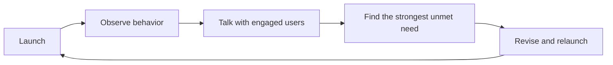

# The Startup Product-Discovery Loop - Launch, Learn, Evolve, Delight

## One-line summary
An early startup discovers its real product by launching a minimally useful version, watching users closely, evolving toward their strongest needs, and making a small group love the total experience.

## Context
An initial idea is a hypothesis, not a specification. The purpose of an early product is to create contact with reality quickly enough that founders can learn what should actually be built.

## Key insights
- **Launch begins the work.** Before launch, founders mostly learn about their own assumptions; after launch, user behavior supplies information that planning cannot.
- **Depth precedes breadth.** It is easier to expand from a few users who love the product than to deepen a large population's mild approval. Strong love is also harder to fake to yourself than an ambiguous claim that the product is “almost good.”
- **The product is the entire experience.** A buggy but useful product paired with extraordinary founder attention can create a better early experience than polished software with indifferent service.
- **Ideas evolve through implementation.** Product discovery resembles writing: important ideas appear while making and revising, not only before work begins.
- **Understanding users is the central variable.** User count and improvement per user form the two dimensions of value; founders control the second more directly, and it drives the first.

## Framework / model (if applicable)

Use a five-step loop: **launch a quantum of utility → observe behavior → speak directly with the most engaged users → identify the strongest unmet need → revise and relaunch**. Repeat until users would be genuinely upset if the product disappeared. Measure behavior and retention, not compliments.

## Tactics / how to apply
- Ship the smallest version that lets a real user complete one valuable job.
- Ask what users attempted, where they hesitated, and what workaround they already use.
- Segment for intensity: find the group using the product most urgently and recruit more people like them.
- Let founders handle support until recurring problems and language are unmistakable.
- Prefer changes that deepen necessity for the core group before adding features for marginal users.
- Before building, run a waiting-list survey that captures current situation, desired outcome, obstacle, preferred solution, and open context.
- With existing customers, segment by how disappointed they would be if the product disappeared; study the “very disappointed” group as the strongest ICP signal and ask the “somewhat disappointed” group what would materially change their answer.
- Package a visibly testable Gold–Silver–Bronze offer, present it in at least thirty customer conversations, and look for several paid commitments rather than compliments.
- After roughly ninety days of delivery, retest disappearance disappointment, experience score, and recommendation intent before declaring product-market fit and scaling acquisition.

## Notable examples
Airbnb's founders improved listings in person and learned the marketplace by working beside hosts. Wufoo sent handwritten notes. These actions looked inefficient but turned user contact into product intelligence and a culture of care.

## Relationships
- **related:** [[Do Things That Don't Scale - Recruit, Delight, and Learn by Hand]]
- **related:** [[Organic Startup Ideas - Live in the Future and Notice What Is Missing]]
- **related:** [[Activation Before Automation - Manual Onboarding to Fix Churn]]

## Source reference
Paul Graham, “Startups in 13 Sentences,” “What I've Learned from Users,” “Be Good,” and “Do Things that Don't Scale,” in [[2026-07-13_Essays_PaulGraham_CollectedEssays]].

Additional source: Daniel Priestley, *Product-Market Fit Framework*, [[2026-07-13_Video_DanielPriestley_ProductMarketFitFramework_RawTranscript]].
