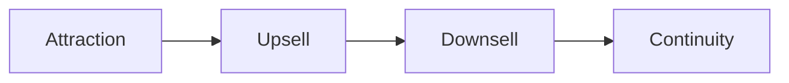

# The Money Model - Sequencing Offers to Fund Growth

## One-line summary
Structure a business as a deliberate, staged sequence of four offer types — attraction, upsell, downsell, continuity — so that 30-day gross profit exceeds twice the customer acquisition cost, meaning every customer pays for their own acquisition (and funds the next one) within a month.

## Context
Hormozi's third business book (2025) answers what *$100M Offers* (what to sell) and *$100M Leads* (how to find buyers) leave open: how to structure a business so cash flow, not just customer count, compounds. The stated trigger is that 82% of business failures are attributable to cash flow problems, with median owner income stuck around $48,000/year — most businesses don't fail from lack of customers, they fail from poor cash sequencing.

## Key insights
- **The core rule:** 30-day gross profit must exceed twice the customer acquisition cost (CAC) plus cost of goods sold — this is the dividing line between a business that funds its own growth and one that slowly bleeds out.
- **The growth formula:** double customer value × double acquisition × double payment speed = 8× growth — small, compounding improvements across three levers multiply rather than add.
- **Sequencing beats simultaneity.** Collapsing the entire money model into a single launch breaks the business; each stage should be built, proven, and cash-positive before the next is layered on.
- **Billing cadence is a growth lever, not an afterthought.** Billing every four weeks instead of monthly yields 13 billing cycles a year instead of 12 — an 8.3% revenue increase that, at 20% margins, increases annual profit by 41% (see also [[Billing-Cycle vs Value-Cycle Alignment]]).

## Framework / model (if applicable)
### The four offer types, deployed in sequence

1. **Attraction Offers** — low-cost or free entry points designed to recover acquisition cost through subsequent purchases. Subtypes: *Win Your Money Back* (customer pays upfront, refunded only if they hit a defined goal — ~90% reinvest the credit rather than cashing out), *Giveaway Offer* (grand prize for contact info, then a discount offer to non-winners), *Decoy Offer* (a stripped-down free version next to a premium option, contrast drives premium take-rate — Hormozi cites an 80% take rate with this method), *Buy X Get Y Free* (reframe pricing so a higher-priced item comes bundled with free additions), *Pay Less Now or Pay More Later* (deferred billing vs. immediate discounted payment with bonus content).

2. **Upsell Offers** — often where the majority of profit is generated (a $2 burger yields $0.25 profit; add fries, a drink, and a supersize option and profit per customer rises to $3.00). Subtypes: *Classic Upsell* (solve the customer's next problem the moment they're aware of it), *Menu Upsell* (combining unselling, prescription upselling, A/B upselling, and card-on-file), *Anchor Upsell* (present the most expensive option first to anchor price, then offer a more affordable option that feels like a deal), *Rollover Upsell* (credit prior purchases toward a new, more expensive offer to reduce churn).

3. **Downsell Offers** — when a buyer says no, restructure *what* is being sold rather than simply discounting (discounting the same product destroys pricing integrity). Subtypes: *Payment Plan Downsell* (spread over scheduled payments at a markup — e.g., $1,000 upfront becomes $1,200 total on a payment plan), *Trial With Penalty* (free trial contingent on meeting defined terms; non-compliance triggers a fee), *Feature Downsell* (lower price by removing features — often causes buyers to realize the value of what was removed and revert to the original offer).

4. **Continuity Offers** — recurring revenue, intentionally placed *last* so earlier offers fund advertising before continuity is introduced. Subtypes: *Continuity Bonus Offer* (value given immediately on sign-up), *Continuity Discount Offer* (free time in exchange for longer commitment), *Waived Fee Offer* (charge a start-up fee for month-to-month, waive it for longer commitments), and the billing-cadence trick described above.

### The three build stages

(1) **Get Cash** — establish an attraction offer that's cash-positive from day one; (2) **Get More Cash** — layer in upsell and downsell offers to maximize revenue per customer; (3) **Get the Most Cash** — integrate continuity offers for recurring revenue. Collapsing all three stages into one launch breaks the business — patience in sequencing is itself a competitive advantage.

## Tactics / how to apply
- Before running any acquisition campaign, calculate whether 30-day gross profit exceeds 2× CAC + COGS; if not, fix the money model before spending more on traffic.
- Introduce upsells and downsells before continuity — continuity should be the capstone once the front end is already cash-positive, not the first thing sold.
- Test billing cadence (e.g., every-4-weeks vs. monthly) as a low-risk, immediate profit lever before pursuing harder growth levers like new channels.
- Price new offers low to generate feedback, then raise prices until additional revenue plateaus — the goal is many ways to offer the same product, not many different products.

## Notable examples
- Hormozi's own Gym Launch case study: began with a Decoy Offer reaching $476,000/month within three months; added upsell/downsell layers to reach $1.5M/month; further offer types pushed it to $2.3M/month within 14 months; integrating a supplement business drove monthly revenue to $4.4M by month 20. He eventually sold 66% of Gym Launch for $46.2M in cash, crossing $100M in net worth at age 31.
- The most dangerous business position identified in the book: customer acquisition costing more than 30-day gross profit returns — a silent killer that looks like growth (rising customer count) while actually bleeding the company of cash.

## Relationships
- **related:** [[The Value Equation and the Grand Slam Offer]]
- **related:** [[The Core Four and the Rule of 100 - Lead Generation Fundamentals]]
- **related:** [[Billing-Cycle vs Value-Cycle Alignment]]
- **related:** [[The Education Continuity Problem - Sell Consumable Inputs, Not the Black Box]]
- **applies:** [[用數學做決策：損益表、PDCA與預測降低不確定性]]

## Source reference
Alex Hormozi, *$100M Money Models* (2025). Archived extraction: [[2026-07-08_Book_AlexHormozi_100MSeriesSummary]].
