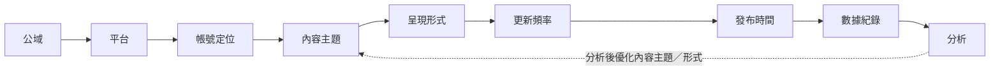
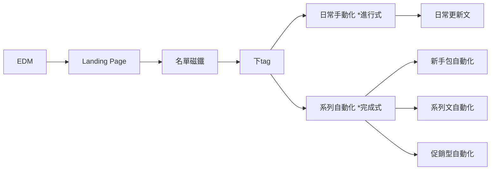

# IP 變現系統 — 流程圖整理

> 本檔為同一套「IP 變現系統」，由不同縮放層級構成：變現主流程、公域內容規劃循環，以及「拉新 → 留存 → 轉化」漏斗（總覽、流量分佈、標籤與自動化細節）。

---

## 一、IP 變現主流程

四階段主軸：

```
人設建立 → 渠道矩陣 → 公域／私域帳號建立 → 接觸點1 → 私域接觸點 → 接觸點2 → 購買／不購買
```

**IP 打造**
- 人設建立（你的品牌核心＆服務內容）
  - 是誰
  - 經歷
  - 特質

**帳號維運**
- 互動模式：帳號本人 ↔ 與用戶雙向互動
- 渠道矩陣
  - **公域帳號建立**（陌生人第一次接觸到你的渠道）
    - 公域-個人網站
    - 公域-社群流量：Instagram／Facebook／Podcast／TikTok
    - 公域-搜尋：Google
    - referral 推薦流量
    - 廣告流量
  - **私域帳號建立**（透過公域被個人特質吸引，且願意接受更高頻接觸）
    - 社群流量-私域：LINE@
    - 直接流量
    - EDM

**帳號維運（拉新 x 精華 x 留存）**
- 接觸點 1（以何固定頻率更新全部內容的形式）
  - 文字（Text）／圖片（Image）／短影音／長影音／音頻（Audio）／直播
- 私域接觸點（高度轉換進私域）
  - 1v All
  - 1v1

**帳號轉化**
- 接觸點 2（如何持續接觸）
  - 筆記／用戶體驗分享應用／體驗折扣碼／LINE@
- 結果
  - 購買
  - 不購買

---

## 二、公域內容規劃循環

主軸為線性流程，末端回饋至「內容主題」形成循環：



- **平台**：YouTube／Facebook／Instagram／TikTok／Threads／電子報／LINE 社群
- **帳號定位**（我是誰，所以我要分享哪些內容；經驗和特質形成獨特視角）
  - 是誰／經歷／特質
- **呈現形式**：文字（Text）／圖片／短影音／長影音／音頻（Audio）／直播／VR／AR
- **更新頻率**：多久發一次文、多久發一次限動；這個單元多久更新一次
- **分析**：分析之後優化內容主題／形式，形成循環

---

## 三、漏斗總覽：拉新 → 留存 → 轉化



| 階段 | 內容 |
|------|------|
| **拉新** | EDM → Landing Page |
| **留存** | 名單磁鐵 → 下tag |
| **留存、轉化** | 系列自動化 |

- **EDM 指標**：開信率／點擊率／抵達率
- **Landing Page**：公域-社群流量（Instagram／Facebook／Podcast）／社群流量-私域（LINE 社群）／公域-個人網站／廣告流量
- **下tag**：不同管道／不同 TA／不同需求
- **日常手動化（*進行式）** → 日常更新文
- **系列自動化（*完成式）**
  - 新手包自動化 → 仙人掌型內容／玫瑰花型內容
  - 系列文自動化 → 仙人掌型內容
  - 促銷型自動化 → 含羞草型內容

---

## 四、流量分佈

```
EDM → Landing page → 各流量渠道
```

**EDM 指標**
- 開信率（AVG OPEN RATE）
- 點擊率（AVG CLICK RATE）
- 抵達率

**Landing page 導流去向**
- 公域-社群流量
  - Instagram
  - Facebook
  - Podcast（Apple Podcast／Spotify／訂閱電子報／IG／FB）
- 公域-個人網站
  - 品牌網站
  - 銷售網站
- 社群流量-私域
  - LINE 社群
- 廣告流量

---

## 五、標籤與自動化系統

**標籤：下tag** 的四種分類邏輯 + 系統自動化：

**下tag 分類**
- 常見 QA
- 不同管道
  - IG
  - FB
  - 活動 → 免費活動／付費活動
- 不同 TA
  - 已購買
  - 未購買
    - 參加免費活動 → 潛在用戶
    - 未參加免費活動 → 沈睡用戶
- 不同需求
  - 創作／創業／生活

**系統**
- 日常手動化（*進行式） → 日常更新文
- 系列自動化（*完成式） → **內容**
  - 新手包自動化 → 仙人掌型內容／玫瑰花型內容 → **關於我**
    - 我在做什麼／我是誰／我提供的服務
  - 系列文自動化 → 仙人掌型內容 → **關於產品**
    - 常見 QA／產品介紹
  - （受歡迎文章）→ 社群 top 10
  - 促銷型自動化 → 含羞草型內容
    - 教育型內容 → 搭配檔期
    - 銷售型內容 → 搭配檔期

---

### 對照備註
- 內容「型別」對應意圖：**仙人掌型**＝定位／專業（關於我、關於產品）；**玫瑰花型**＝形象／人設；**含羞草型**＝促銷（教育＋銷售，搭配檔期）。
- 第三、四、五節為同一漏斗的不同視角：結構總覽、流量分佈、標籤與自動化落地。
