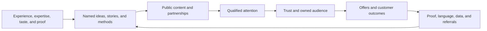
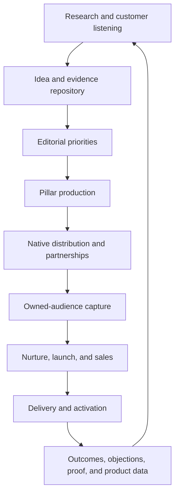

# Creator and Personal Brand Businesses: An Industry Handbook

*Research snapshot: 18 July 2026. Synthesized from THE WIKI’s strategy, social-media, operating-system, framework, research, and source-library clusters, supplemented by current external evidence.*

## Executive thesis

A creator business is not fundamentally a content business. It is a **trust-and-intellectual-property business with content as its sensing and distribution layer**.

The founder begins with something scarce: expertise, taste, experience, a point of view, access, personality, or a demonstrated result. The business turns that scarce input into reusable assets—ideas, stories, methods, media, curriculum, community, software, licensing, and brand associations—that can serve many people without requiring a proportional increase in founder hours.

The operating loop is:

The loop compounds only when all of its parts connect. Attention without an offer creates an under-monetized media property. An offer without distribution creates a capable but obscure expert. Sales without strong delivery exhaust reputation. Content without owned audience capture leaves the relationship with the platform. Products without proof become commodities. A founder who never converts judgment into systems remains self-employed at scale.

The strongest version of this business has five assets:

1. **A reputation:** a clear, favorable association in the mind of a specific market.
2. **A distribution system:** repeatable access to qualified attention across public and owned channels.
3. **A body of IP:** named methods, stories, data, curriculum, media formats, and tools that make the founder’s knowledge transferable.
4. **An offer system:** multiple ways for people with different readiness, budgets, and desired levels of access to buy.
5. **An outcome engine:** delivery that reliably produces customer success, proof, retention, and referrals.

Near-zero marginal delivery cost is possible for digital files and recorded media, but the whole business never has zero marginal cost. Customer acquisition, support, community moderation, live access, sales, refunds, payment fees, creative production, platform risk, and reputation management remain real. The strategic goal is not “maximum scale.” It is to decide where human scarcity creates value and where software, media, curriculum, community, and systems can remove unnecessary scarcity.

The central conclusion of this report is:

> **Audience is not the asset by itself. The asset is the ability to repeatedly turn qualified attention into trusted relationships, customer outcomes, and reusable IP without depleting the founder.**

---

## 1. Industry overview

### 1.1 What qualifies as a creator or personal-brand business

This industry includes businesses in which a founder’s expertise, taste, experience, reputation, or personality is a primary reason people pay attention or buy. Typical forms include:

- expert educators selling courses, cohorts, memberships, or certifications;
- coaches and consultants who use content to generate demand and productize their methods;
- newsletter, podcast, YouTube, short-form, and livestream businesses;
- authors, speakers, artists, trainers, teachers, and practitioners commercializing ideas or creative IP;
- founder-led operating companies whose personal media reduces customer-acquisition cost and increases trust;
- media brands that begin around one person and later expand into products, talent, or multiple properties.

The boundary is economic, not aesthetic. A freelancer who posts occasionally but still sells only hours is not yet operating a leveraged creator business. A founder of a software or consumer company may be operating one if personal media functions as a scalable demand and trust engine. A large influencer may have reach but not a business if revenue depends on sporadic platform payouts and sponsorships.

The defining shift is from:

> **person performs work → customer pays**

to:

> **person develops insight and proof → business packages it into media, IP, products, systems, and influence → many customers receive value**

### 1.2 The audience → trust → offer → IP flywheel

The commonly described audience flywheel is incomplete unless it begins and ends with proof.

1. **Experience and proof create raw material.** The founder solves a problem, develops taste through practice, or achieves a result worth studying.
2. **The raw material becomes legible IP.** The founder names the outcome, explains the mechanism, records the steps, and develops a distinct vocabulary.
3. **Content distributes fragments of that IP.** Short-form creates discovery; long-form develops comprehension; live interaction demonstrates judgment; email and community sustain the relationship.
4. **Repeated useful exposure builds trust.** The audience learns what the founder stands for, whether the advice works, and what kind of future the brand represents.
5. **Offers convert trust into commitment.** Money, time, effort, and identity investment distinguish passive attention from actual demand.
6. **Delivery creates outcomes.** Outcomes generate testimonials, product improvements, customer language, case studies, referrals, and new stories.
7. **Those outputs become better content and stronger IP.** The next cycle starts with more proof than the last.

This explains why “just post more” is incomplete advice. Publishing accelerates a useful loop only if there is a mechanism for learning, conversion, and proof. Otherwise it accelerates the production of disposable media.

### 1.3 The economic engine

A useful first-principles revenue model is:

> **Revenue = qualified reach × owned-audience capture × offer exposure × conversion × average collected revenue × purchase frequency**

Contribution is:

> **Contribution = collected revenue − acquisition cost − delivery cost − refunds − commissions − payment/platform fees − support cost**

And long-term enterprise quality depends on:

> **Asset quality = trust × direct reachability × repeatability × transferability × retention − concentration risk**

These equations reveal several things:

- A million low-intent followers can be worth less than ten thousand reachable buyers in a painful, high-value niche.
- Gross revenue can conceal weak economics when live delivery, community support, commissions, refunds, or founder time are expensive.
- A one-time course can have high gross margin and weak lifetime value.
- A premium service can have lower delivery leverage but superior cash flow, proof density, and customer learning.
- Owned email, customer data, and community improve reachability but do not guarantee attention; deliverability and engagement still matter.
- Brand reduces future transaction friction. Customers buy faster, refer more often, accept adjacent offers, and require less proof on every new launch.

The advertising side of the industry is now economically material. IAB projected U.S. creator ad spend at **$37 billion in 2025**, up 26% year over year, and expected **$44 billion in 2026**; 48% of creator-ad buyers described creators as a “must buy.” IAB also identified creator selection and measurement as persistent buyer problems, which means trusted fit and evidence of business outcomes matter more as the market matures. [IAB, 2025 Creator Economy Ad Spend & Strategy Report](https://www.iab.com/insights/2025-creator-economy-ad-spend-strategy-report/)

### 1.4 Why some creator businesses scale

Businesses scale when they convert founder-specific value into assets that retain the founder’s advantage without requiring the founder in every transaction.

The recurring scale factors are:

- **A valuable market problem.** The audience has money, urgency, and a reason to change.
- **A differentiated proof base.** The founder has done, observed, or discovered something that generic content cannot easily imitate.
- **A recognizable position.** The market can quickly say who the brand is for, what it helps with, and why this source is distinct.
- **Content–offer continuity.** The reason people watch is related to the reason they buy.
- **Format–channel fit.** The same idea is expressed natively in the discovery, trust, and conversion formats each channel supports.
- **Owned follow-up.** Public attention can be reached again through email, customer records, community, events, or another direct mechanism.
- **Productization.** Repeated diagnosis and delivery become a named path, curriculum, tool, template, or trainable process.
- **Proof capture.** Delivery continuously generates new case material instead of requiring content to be invented from scratch.
- **A portfolio with distinct jobs.** One offer acquires, one creates cash, one delivers the core transformation, and perhaps one retains or expands.
- **An operating cadence.** Research, production, distribution, email, sales, delivery, and review happen through a repeatable week.

### 1.5 Why others plateau

Plateaus usually come from a broken connection rather than a lack of ideas.

| Symptom | Likely structural problem |
| --- | --- |
| Views rise, revenue does not | Audience–offer mismatch; weak capture; entertainment unrelated to purchase intent |
| Good sales, low profit | High delivery/support cost; refunds; excessive founder access; weak price |
| Large list, poor launches | Low engagement; weak promise; wrong audience source; over-mailing or under-nurturing |
| Strong first launch, declining later launches | Market consumed finite information; weak product results; audience fatigue; no new segment or continuity |
| Founder fully booked | Expertise was marketed but not productized; price or delivery ratio is too low |
| Team creates more content but results fall | Founder’s taste and judgment were not converted into standards; volume replaced signal |
| Platform audience stops growing | Format fatigue; weak topic-market fit; distribution concentration; insufficient experimentation |
| Community churns | Access was sold as continuity, but fresh value, member quality, or activation is weak |
| Many products, little clarity | Offers compete with one another; no primary ascension path; novelty replaced focus |

The most dangerous plateau is disguised success: the founder has income and reach, but every sale, piece of content, product update, and customer escalation still depends on them. The business has leverage in delivery but not in decision-making.

---

## 2. Business models

No single monetization model is universally best. Each stream performs a different job and carries a different constraint. Strong businesses stack models deliberately instead of adding every available revenue stream.

### 2.1 Model comparison

| Model | Customer or buyer pays for | Economic strengths | Structural constraint | Best role in the portfolio |
| --- | --- | --- | --- | --- |
| Advertising and sponsorships | Access to attention, trust, creative execution, or distribution | No owned product delivery; can monetize free media; large deals at scale | Volatile budgets; platform and brand-safety exposure; audience trust can be spent | Media monetization and diversification after audience–brand fit is clear |
| Affiliate marketing | Attributed sale or lead for another company | Fast to start; tests buying intent; no inventory or product support | Low control over product, terms, attribution, and customer data | Early monetization, recommendation layer, or complement to owned products |
| Digital products | Information, templates, prompts, assets, tools, or shortcuts | Near-zero unit delivery cost; global; automated | Easy to copy; low urgency; support/refund burden; often low retention | Entry product, utility layer, lead qualification, or high-margin catalog |
| Self-paced courses | A structured learning path | Scalable delivery; strong gross margins; reusable curriculum | Completion and implementation are weak without support; finite curriculum | Core education for motivated customers or a lower-access tier |
| Cohort courses | Transformation with schedule, feedback, and peer momentum | Higher completion and price; proof-rich; live learning improves curriculum | Calendar-bound; facilitation burden; cohort quality and time zones | Premium proof engine before mature evergreen delivery |
| Memberships and communities | Ongoing access, identity, relationships, updates, accountability, or events | Recurring revenue; peer network effects; retention data | Churn if value is finite or passive; moderation and programming cost | Continuity when value genuinely renews |
| Consulting and high-ticket service | Diagnosis, speed, customization, implementation, and risk reduction | Fast cash; deep customer learning; high proof density | Founder capacity; sales complexity; customization creep | Early validation, premium tier, research lab, or strategic backend |
| Licensing and IP | Rights to use a method, curriculum, format, brand, certification, or content | High leverage; expands through partners; potentially recurring royalties | Quality control, legal definition, enforcement, partner dependence | Mature scaling once the method is proven and codified |
| Speaking and books | Ideas, status transfer, access, or organizational learning | Authority, reach, partnerships, lead generation; books compound trust | Often low direct margin; travel and event cycles; hit-driven | Credibility and top-of-funnel more than primary profit engine |
| Content-led operating business | Product or service from a separate company | Media lowers acquisition cost and adds trust to a defensible operating asset | Content may distract from product; company reputation tied to founder | Often the highest enterprise-value path when product economics are strong |

### 2.2 Advertising and sponsorships

Sponsorships sell a bundle of:

- audience access;
- trust transfer;
- creative production;
- distribution;
- cultural relevance;
- sometimes usage rights and paid amplification.

Pricing should therefore not be reduced to follower count. Relevant variables include average qualified reach, audience geography, category fit, format, production burden, exclusivity, usage rights, whitelisting, duration, conversion evidence, and brand-safety risk.

Platform revenue sharing is another advertising model, but it is controlled by the platform. YouTube’s current partner terms illustrate both the opportunity and dependence: eligible creators receive 55% of net watch-page advertising revenue, 45% of revenue allocated to them from the Shorts creator pool, and 70% of net revenue from specified fan-funding features; YouTube explicitly says payment is not guaranteed. [YouTube Partner earnings overview](https://support.google.com/youtube/answer/72902?hl=en-GB)

Sponsorships work best when:

- the product is congruent with why the audience follows;
- the creator would credibly recommend it without payment;
- the creative preserves the creator’s native voice;
- performance is evaluated beyond vanity reach;
- sponsored density does not train the audience to ignore recommendations.

They work poorly when the brand borrows reach but receives no trust, the creator accepts unrelated deals, or the audience cannot distinguish an honest recommendation from rented enthusiasm.

### 2.3 Affiliate marketing

Affiliate revenue is often the fastest bridge from attention to commerce. It teaches what the audience clicks, buys, and values without requiring product development.

Its strategic uses are:

- validating commercial intent;
- monetizing tools already central to the creator’s workflow;
- filling gaps the creator should not build;
- adding a revenue layer to reviews, tutorials, or resource libraries;
- creating reciprocal partnerships with centers of influence.

The risk is that the creator optimizes commissions rather than audience outcomes. This spends trust for short-term income and teaches the market that every recommendation has a hidden motive. A durable rule is: **recommendation quality must be evaluated as if the commission did not exist**.

In the United States, a material connection includes payment, employment, family or personal relationships, free products, discounts, and other value. The FTC says disclosures must be easy to notice, placed with the endorsement, and included in the video itself rather than only in a description; livestream disclosures should recur. [FTC, Disclosures 101 for Social Media Influencers](https://www.ftc.gov/business-guidance/resources/disclosures-101-social-media-influencers)

### 2.4 Digital products

Digital products include templates, playbooks, databases, presets, prompts, design assets, ebooks, calculators, scripts, research libraries, swipe files, and specialized tools.

They are strongest when they remove work, reduce uncertainty, or compress time. Pure information is increasingly abundant. A product becomes more defensible when it includes:

- a proprietary data set or research process;
- a tool that performs part of the job;
- a workflow embedded in the customer’s routine;
- updates tied to a changing environment;
- examples and decisions from real cases;
- a trusted brand and customer community;
- integration with a larger transformation.

The best digital products are often the artifacts already used in delivery: an assessment, calculator, template, checklist, dashboard, briefing format, or decision tree. Productization begins by observing repeated work, not by inventing a PDF.

### 2.5 Courses and cohorts

A course sells a path through a problem. The real product is not video access; it is a reduction in:

- uncertainty about what to do;
- time to competence;
- avoidable mistakes;
- effort required to organize information;
- perceived risk of acting.

Self-paced courses maximize schedule flexibility and delivery leverage. Cohorts add deadlines, live feedback, peer visibility, identity, and social pressure. Those additions often improve action and justify higher pricing, but they make delivery less passive.

Courses plateau when they sell a finite black box as if it were recurring value. Once a customer learns the material, the need disappears. Sustainable continuity must sell something that renews: feedback, fresh opportunities, new data, ongoing practice, changing regulations, accountability, relationships, group purchasing, access, or advanced applications.

### 2.6 Memberships and communities

A community is not a chat room bundled with content. Its product is:

> **the quality of the people × the relevance of their interactions × the rituals that turn access into progress**

This creates a selection problem. Who is admitted shapes:

- safety and signal-to-noise;
- status and identity;
- member willingness to contribute;
- quality of introductions;
- retention;
- the burden on the host.

Communities become more valuable when members help one another without the founder mediating every exchange. This is the transition from an audience, where value flows one-to-many, to a network, where value also flows many-to-many.

The 2025 State of Create study reported that creators increasingly prioritize creative quality, fan relationships, and stability over follower and view metrics; it also estimated a large and growing direct-to-fan market. Because Patreon commissioned the research and benefits from direct-to-fan adoption, its market-sizing and platform comparisons should be treated as directional, not neutral industry measurement. The underlying behavior—core fans buying, participating, and creating value for one another—is nevertheless consistent with the mechanisms in THE WIKI. [State of Create 2025](https://stateofcreate.co/)

### 2.7 Consulting and high-ticket services

High-ticket service is not a failure of leverage. It is often the best first laboratory.

It provides:

- cash before a large audience exists;
- close observation of the customer’s real constraints;
- the language customers use;
- objections and failure patterns;
- proof and case studies;
- a premium price anchor;
- a way to learn which parts should be standardized.

The progression is usually:

> **done for you → done with you → one-to-many guided implementation → self-serve tools or education → certification or licensing**

Not every business should complete the progression. Some problems remain valuable because judgment, accountability, or customization matters. The purpose of early high-ticket work is to find the repeatable rails while preserving the human decisions customers truly pay for.

### 2.8 Licensing and IP

Licensing begins when the business can specify what the other party is allowed to use:

- a named methodology;
- curriculum and instructional materials;
- content formats or characters;
- a certification mark;
- a brand;
- a data set;
- software or tools;
- distribution rights;
- derivative or localization rights.

Licensing scales only after the IP is defined, valuable, trainable, and quality-controlled. Otherwise it distributes ambiguity and reputation risk. A licensing system needs standards, training, audit rights, version control, commercial terms, and consequences for misuse.

### 2.9 Speaking and books

Books and speaking often generate more value indirectly than directly.

They can:

- compress a body of thought into durable IP;
- create status and third-party credibility;
- attract podcasts, partnerships, clients, and talent;
- give audiences several hours with the founder;
- create a low-friction entry into higher-value offers;
- make vocabulary and frameworks portable.

A book is therefore frequently a “product for prospects”: paid or free education that causes the right customer to understand the problem and self-identify before a larger purchase.

### 2.10 Content as a growth engine for a separate company

This is often the most powerful model because it combines a low-cost trust engine with an operating asset whose value does not depend entirely on media economics.

Examples include content driving:

- software;
- an agency or consultancy;
- consumer products;
- events;
- a recruiting marketplace;
- an investment firm;
- a studio;
- an education company with multiple instructors.

The media makes paid acquisition more effective because a prospect exposed to an ad can inspect the founder’s public body of work before buying. Conversely, the operating business supplies proof, customer language, behind-the-scenes material, and research for content.

The danger is role confusion. Content must serve the company’s market and brand without turning the founder into a separate celebrity whose incentives, promises, or audience drift away from the product.

### 2.11 How revenue streams are stacked and sequenced

The usual lifecycle sequence is:

1. **Sell a service or premium intervention.** Validate that the problem is valuable and learn the delivery work.
2. **Capture proof and name the method.** Turn repeated success into stories, steps, tools, and a distinctive mechanism.
3. **Build public distribution and an owned list.** Publish around the problem, result, worldview, and proof.
4. **Create a prospect product or paid front door.** An assessment, workshop, book, mini-course, or template qualifies interest.
5. **Productize the core transformation.** Cohort, guided program, standardized consulting, or software-supported service.
6. **Add a lower-access scalable tier.** Self-paced course, digital product, or library for customers who need less support.
7. **Add continuity only if value renews.** Community, data, feedback, updates, events, or access.
8. **Add sponsorships, affiliates, and media monetization selectively.** These monetize attention without confusing the primary promise.
9. **License, certify, or build additional brands after the IP and quality system are mature.**

Revenue streams should be assigned jobs:

| Portfolio job | Typical vehicle |
| --- | --- |
| Audience acquisition | Free content, book, assessment, low-cost workshop |
| Cash and learning | Consulting, implementation, premium cohort |
| Core transformation | Flagship program, software-supported service, product |
| Scale | Self-paced course, digital product, licensing |
| Retention and expansion | Community, updates, advanced program, recurring tool |
| Media monetization | Sponsorships, platform revenue share, affiliate |
| Authority | Books, research, speaking, high-quality long-form media |

Adding a stream without a job creates complexity, channel conflict, and founder distraction.

---

## 3. Offer design and pricing

### 3.1 The free-to-paid value ladder

Free and paid value are not opposites. They perform different functions.

Free content should help the audience:

- recognize a problem;
- understand why old attempts failed;
- see the desired outcome;
- trust the creator’s judgment;
- understand the map or mechanism;
- experience a small win;
- decide whether the approach fits.

Paid offers should increase:

- implementation;
- speed;
- personalization;
- accountability;
- feedback;
- access;
- tooling;
- risk reduction;
- completeness;
- social environment.

A useful rule from THE WIKI is **declarative to sell, procedural to deliver**. Public content can generously explain what matters, what is possible, why it works, and how the path is structured. Customers pay when they want the complete sequence, application to their circumstances, feedback, tools, or execution. Hiding all useful information behind a paywall weakens trust; giving away labor-intensive personalization confuses content with delivery.

### 3.2 A practical offer ladder

| Layer | Typical price logic | Customer job | Examples |
| --- | --- | --- | --- |
| Free public value | No price; earns attention | Discover, diagnose, believe | Short-form, newsletter, podcast, YouTube, public workshop |
| Free owned-audience entry | Contact permission | Self-identify and continue | Assessment, checklist, email course, webinar |
| Front-end / low-ticket | Low-risk commitment | Sample the method and qualify | Workshop, challenge, book, template, mini-course |
| Core / mid-ticket | Transformation with structure | Complete the main journey | Self-paced course, cohort, group program, membership with a defined outcome |
| Premium | Price reflects access, speed, stakes, and customization | Reduce risk and accelerate | Consulting, mastermind, implementation, private advisory |
| Continuity / expansion | Aligned to renewing value | Maintain, advance, connect, update | Community, data, software, recurring advisory, advanced programs |

The ladder is not mandatory. A highly specific B2B expert may need only public content, a diagnostic, and a premium engagement. A mass consumer creator may use free media, a low-ticket catalog, sponsorships, and a membership. Simplicity is an advantage.

### 3.3 Ascension paths

Ascension should follow the customer’s changing problem, not the seller’s desire for a higher average order value.

Healthy ascension moves along one or more dimensions:

- less uncertainty;
- faster progress;
- more support;
- higher stakes;
- broader implementation;
- deeper identity or community;
- ongoing maintenance;
- advanced applications.

Unhealthy ascension withholds essential parts of the first promise, forces customers through irrelevant tiers, or makes the expensive offer the only way to get a usable result.

The most effective next offer is often discovered during delivery: “What becomes the customer’s next constraint after this offer succeeds?”

### 3.4 Pricing strategy

Price is a claim about value, positioning, capacity, and risk.

Perceived value rises when the offer improves:

> **desired outcome × perceived likelihood of success**

and reduces:

> **time delay × effort and sacrifice**

This does not mean making implausible promises. It means:

- choosing a customer with an expensive or meaningful problem;
- defining a visible result;
- increasing proof;
- reducing ambiguity;
- creating an early win;
- removing unnecessary steps;
- providing the right level of support;
- transferring implementation risk through tools, feedback, or a carefully bounded guarantee.

#### Barbell pricing

Many creator businesses are strongest at the ends:

- expensive, high-access, high-outcome work for a few customers;
- inexpensive, low-support products for many customers.

The crowded middle can carry the support expectations of premium work without enough margin, while lacking the scale of true mass-market products. Starting with an “unscalable” premium offer is often rational because it generates cash, proof, language, and learning. The scalable product comes after the founder understands what must be standardized.

#### Good / better / best

Tiers should correspond to real differences:

- self-serve vs group vs private;
- slower vs faster;
- standard vs customized;
- content only vs feedback vs implementation;
- community access vs expert access.

Do not manufacture feature clutter merely to make the middle tier attractive.

#### Billing cadence

Billing cadence should match the cadence of value. Monthly payment is credible for monthly data, access, coaching, community, software, or ongoing work. It is less credible when a finite course has been sliced into recurring charges without fresh value. Annual plans work when the customer receives a full-year system and the business can activate usage early enough to avoid regret.

#### Guarantees, scarcity, and payment plans

- A guarantee should reverse a risk the business can influence and specify customer obligations.
- Scarcity should come from real capacity, cohort dates, access limits, or inventory—not fabricated countdowns.
- Payment plans increase access but also default risk, support duration, and cash-flow complexity.
- Collected cash matters more than nominal contract value.

### 3.5 Packaging expertise into scalable IP

A repeatable packaging method is:

1. **Find a proof story.** Identify a specific customer or personal result with a measurable before and after.
2. **Name the outcome.** A named result is easier to remember, discuss, and sell.
3. **Identify the ideal customer and triggering situation.**
4. **Reconstruct the mechanism.** What changed the outcome, and in what order?
5. **Separate universal rails from expert judgment.** Standardize the repeated sequence; preserve discretionary decisions.
6. **Create artifacts.** Assessment, framework, checklist, template, rubric, calculator, scripts, examples, and milestones.
7. **Deliver manually.** Watch where customers misunderstand, stall, or need support.
8. **Capture evidence and revise.**
9. **Choose a delivery ratio.** Private, small group, cohort, community, software-supported, self-serve, licensed, or some combination.
10. **Define version control and quality standards.**

The moat is rarely the information alone. It is the combination of proof, selection, sequence, examples, tools, customer data, brand, and an outcome-producing delivery environment.

---

## 4. Audience acquisition and distribution

### 4.1 The distribution portfolio

Creator distribution has four jobs:

| Job | Primary formats | What success means |
| --- | --- | --- |
| Discovery | Short-form video, social posts, clips, collaborations, search | Qualified new people encounter the idea |
| Trust | Long-form video, podcast, essays, case studies, live sessions | People understand the creator’s judgment and spend meaningful time |
| Capture | Email opt-in, assessment, registration, community application | The relationship becomes directly reachable |
| Conversion and retention | Email, launches, events, sales pages, calls, customer community | Attention becomes commitment, outcomes, repeat purchase, and referral |

One format can perform several jobs, but assuming one channel will do all four is fragile.

### 4.2 Platform dynamics

Social platforms are rented discovery systems. They optimize for their own objectives—retention, sessions, ad inventory, commerce, and user satisfaction—not for creator stability.

Algorithmic distribution generally uses observable behavior:

- whether users stop;
- watch time and completion;
- shares, saves, comments, and negative feedback;
- topic, captions, audio, and metadata;
- prior user interests and relationships;
- whether the next action keeps the session valuable.

TikTok’s official explanation, for example, says recommendations use user interactions, video information, and lower-weight device/account settings; it also explains that feeds are personalized to each user. These mechanics support the durable principle that **distribution follows predicted viewer interest, not creator entitlement**, though individual weights and product behavior can change. [TikTok, How TikTok recommends videos for For You](https://newsroom.tiktok.com/how-tiktok-recommends-videos-for-you?country=1210&lang=en)

The implication is not to “make content for the algorithm” in a simplistic sense. The platform is a proxy for viewer behavior. Creators should:

- understand native packaging;
- make the value immediately legible;
- earn continued attention;
- preserve a distinct point of view;
- move qualified people toward a direct relationship.

### 4.3 Content formats and their economic roles

#### Short-form

Short-form is a high-frequency testing and discovery medium. It is good for:

- hooks;
- one problem or insight;
- before/after proof;
- visual demonstration;
- strong opinions;
- story fragments;
- excerpts from larger work.

It creates breadth but often weak depth. A viral piece can attract the wrong audience, and entertainment may not transfer to an expert offer.

#### Long-form

Long-form allows the audience to inspect reasoning, evidence, personality, and consistency. It is good for:

- complete frameworks;
- case breakdowns;
- conversations;
- research;
- nuanced trade-offs;
- demonstrations of judgment.

It creates fewer but more informed relationships. Long-form also generates source material for short-form, email, and products.

#### Live

Live formats demonstrate real-time competence and create mutual presence. Webinars, livestreams, workshops, calls, and events are valuable when trust depends on seeing the founder respond to uncertainty rather than reading polished answers.

#### Written

Writing sharpens thought, creates searchable and referenceable assets, and travels well across newsletters, posts, books, reports, scripts, and product material. Its value is not only distribution; writing is a method of discovering what the creator actually thinks.

#### Audio

Podcasts and audio create habitual, extended attention during otherwise unavailable time. Guest appearances borrow distribution and trust from another host. A ladder from smaller to larger shows works because performance, proof, and audience fit become visible to future hosts.

### 4.4 The content engine

A durable content operation follows:

> **research → repository → editorial choice → production → native distribution → capture → analysis → reuse**

#### Research

Research sources include:

- customer calls and objections;
- delivery observations;
- search and comment language;
- competitor outliers;
- books and source documents;
- personal experience;
- experiments;
- news or changing rules;
- interviews and partner conversations.

#### Repository

Useful idea buckets are:

- far-past lessons;
- recent work and conversations;
- real-time observations;
- intentionally manufactured experiments;
- customer proof;
- recurring questions;
- contrarian beliefs;
- examples and demonstrations.

Ideas should be captured when they occur, not reconstructed on production day.

#### Editorial selection

Choose pieces based on:

- audience problem;
- business objective;
- novelty or timeliness;
- available proof;
- format fit;
- production intensity;
- relationship to the offer.

A sustainable weekly portfolio can combine a small number of high-intensity pieces with more low-intensity observations or derivatives.

#### Production and waterfall distribution

One pillar asset can become:

- a long-form video or essay;
- several short clips;
- social posts or carousels;
- a newsletter;
- a live discussion;
- a case study;
- an FAQ;
- product material.

Repurposing works when the idea is re-expressed natively, not mechanically cross-posted without context.

#### Review

Use a 70/20/10 allocation:

- roughly 70% proven topics and formats;
- 20% variations on the creator’s own outliers;
- 10% meaningful experiments.

The exact ratio is a heuristic. The principle is to exploit known signal while preserving enough exploration to avoid creative stagnation.

### 4.5 Organic growth loops

The strongest organic loops are:

1. **Proof loop:** customer result → content → new customer → more proof.
2. **Format loop:** outlier → variation → stronger audience expectation → more reliable distribution.
3. **Search loop:** evergreen answer → discovery over time → links and citations → higher authority.
4. **Collaboration loop:** guest value → borrowed trust → new owned subscribers → future partnership.
5. **Community loop:** member contribution → more member value → retention and referrals → stronger member pool.
6. **Product loop:** user artifact or result → shareable output → new users.
7. **Event loop:** live interaction → insight and footage → public content → next event registrations.

### 4.6 Owned versus rented audiences

Ownership is a spectrum, not a binary.

| Asset | Reach control | Data access | Portability | Main risk |
| --- | --- | --- | --- | --- |
| Social followers | Low | Low | Low | Algorithm, policy, account loss |
| Search visibility | Medium-low | Low | Low | Ranking and platform changes |
| Marketplace customers | Medium-low | Medium | Low-medium | Platform rules and fees |
| Email list | High but deliverability-dependent | High | High | Spam placement, list decay, consent |
| SMS or messaging list | High but regulated and costly | High | Medium-high | Consent, frequency fatigue, platform policy |
| Customer database / CRM | High | High | High | Privacy, security, data quality |
| Hosted community | Medium-high | High | Medium-high | Participation decay, moderation, tool dependence |
| In-person events and relationships | High relational control | Variable | High | Capacity and geography |

An email address is valuable because it is permission to continue, not because it guarantees attention. The quality of the list depends on source, promise, deliverability, recency, and behavior.

### 4.7 How cold attention becomes a customer

The conversion path is psychologically nonlinear even if the back-end automation is linear:

1. **Pattern interrupt:** a relevant problem, desire, story, or proof earns the first second.
2. **Recognition:** the viewer sees their situation described accurately.
3. **Credibility:** the creator demonstrates expertise, similarity, evidence, or third-party validation.
4. **Comprehension:** the viewer understands the mechanism and why prior attempts failed.
5. **Low-risk action:** follow, save, subscribe, take an assessment, attend a workshop, or buy a small product.
6. **Repeated confirmation:** email, long-form, case studies, and community reduce uncertainty over time.
7. **Trigger:** urgency, readiness, a new pain, a life event, or a campaign moves the customer from learning to acting.
8. **Offer:** the next step is clear, relevant, and proportionate to trust.
9. **Activation:** the customer quickly experiences progress and confirms the purchase was wise.

The audience is not one awareness state. Some are unaware, some are researching, some are comparing, and some are ready. Free content should serve the broad learning market while campaigns and sales paths make it easy for ready buyers to act.

---

## 5. Trust, retention, and referrals

### 5.1 Why audiences keep consuming

People return for combinations of:

- **utility:** the content improves a decision or skill;
- **sense-making:** the creator explains a confusing world;
- **taste:** curation saves the audience from evaluating everything;
- **identity:** consuming and sharing the work says something about who they are;
- **narrative:** the audience wants to see what happens next;
- **companionship and familiarity:** repeated exposure creates a felt relationship;
- **belonging:** the audience recognizes other people like them;
- **aspiration:** the creator represents a desired future;
- **surprise within consistency:** the subject is familiar but the insight is not predictable.

Consistency matters because it stabilizes expectation. Sameness does not. A durable creator has a recognizable promise and worldview with enough intellectual or creative variation to remain interesting.

### 5.2 The trust stack

Trust is not a single emotion. It has several layers:

1. **Identity:** Is this a real, stable person or organization?
2. **Competence:** Can they produce the claimed result?
3. **Integrity:** Do actions match words, including under commercial pressure?
4. **Alignment:** Do their incentives make sense for the audience?
5. **Proof:** Have they done it, shown it, or produced results for relevant others?
6. **Containment:** Are mistakes, conflicts, privacy, and harm managed responsibly?
7. **Consistency:** Has the pattern held over time?

Expertise becomes more important as stakes rise. Entertainment can rely on personality; financial, medical, legal, or high-cost business advice requires stronger evidence, boundaries, and third-party proof.

Research on influencer behavior supports the importance of credibility and parasocial interaction but should not be generalized beyond its context. A 2025 experiment involving health influencers found that the micro-influencer condition produced greater source credibility and parasocial interaction, which mediated intent to follow. This supports a mechanism—familiarity and perceived credibility can matter more than celebrity scale—rather than a universal rule. [Connell et al., *Journal of Creative Communications*](https://journals.sagepub.com/doi/full/10.1177/09732586241295383)

### 5.3 Why customers buy again

Repeat purchase comes from a different question than first purchase.

First purchase asks:

> “Do I believe this can help me?”

Repeat purchase asks:

> “Did the relationship produce value, and is there a credible next problem to solve?”

Repeat drivers include:

- an early win;
- clear progress;
- product quality;
- an honest promise;
- a natural next milestone;
- continuing relevance;
- convenience and habit;
- identity and community;
- confidence that the next offer will also be well curated.

The best retention strategy is a good initial outcome. Tactics cannot permanently compensate for a weak product.

### 5.4 Community effects

Community changes the value function from founder-only access to a network:

> **Member value = founder value + peer value + accumulated shared knowledge + identity**

This can reduce founder dependence, but only if:

- admission creates enough shared context;
- members are activated and introduced;
- contribution is rewarded;
- recurring rituals exist;
- experts and moderators maintain quality;
- archives and knowledge remain findable;
- commercial promotion is governed.

The founder’s job shifts from answering every question to curating the people, norms, rituals, and knowledge system.

### 5.5 Referral loops

Referrals occur when three conditions coincide:

1. the customer experienced a result worth discussing;
2. sharing creates social value for the referrer;
3. the referral action is easy and well timed.

Design shareable proof:

- before/after artifacts;
- certificates or milestones;
- public showcases;
- templates with attribution;
- customer stories;
- guest invitations;
- a clear phrase for who the offer helps.

Ask near the moment of peak satisfaction, not randomly. Make the request specific: “Who else is facing this situation?” is stronger than “Please refer a friend.”

### 5.6 Brand equity and reputation as a moat

A brand is an association: when the market encounters a name, what belief and action follow?

Brand strength has three dimensions:

- **reach:** how many people hold the association;
- **direction:** whether it attracts or repels;
- **influence:** whether the association changes behavior.

Reach without favorable direction creates notoriety. Favorability without influence creates pleasant awareness. Influence in a tiny market can still create a highly profitable boutique.

Reputation compounds because each delivered promise reduces the proof required for the next transaction. Competitors can copy topics, formats, logos, and claims. They cannot instantly copy:

- a long record of outcomes;
- trusted relationships;
- a distinct body of work;
- proprietary customer knowledge;
- lived experience;
- accumulated community;
- a founder’s judgment and taste.

Reputation is also fragile leverage. A misleading sponsorship, poor customer outcome, public inconsistency, or careless AI-generated claim can damage several revenue streams at once.

---

## 6. Operations

### 6.1 The creator-business operating system

Successful creator businesses operate through connected systems, not isolated posting.

### 6.2 Content production workflow

#### Intake

Capture:

- customer questions;
- sales objections;
- proof and milestones;
- research excerpts;
- personal observations;
- competitor formats;
- industry changes;
- examples;
- founder voice notes;
- product decisions.

Every item should carry enough context to be usable later: source, audience problem, claim, evidence, possible format, and offer relationship.

#### Editorial planning

An editorial review should decide:

- the business objective;
- the audience segment and awareness state;
- the main promise;
- the proof available;
- the content format;
- production intensity;
- distribution channels;
- next step, if any.

This prevents the calendar from becoming a collection of unrelated ideas.

#### Production

Separate:

- source and research;
- outline or script;
- recording or drafting;
- editing and design;
- factual and legal review;
- packaging;
- publishing;
- reuse.

The founder should spend time where taste, lived experience, judgment, and voice are most valuable. Research collection, transcription, rough clipping, versioning, scheduling, and reporting can often be delegated or automated.

#### Quality control

Use checklists for:

- clear audience relevance;
- accurate claims and source support;
- opening promise;
- proof;
- structure and pacing;
- native platform format;
- brand consistency;
- sponsorship disclosure;
- rights and permissions;
- accessibility;
- link and tracking integrity.

### 6.3 Research systems

The highest-quality creator businesses treat research as infrastructure.

A practical repository includes:

- source documents with dates and links;
- verbatim customer language;
- case files and permissions;
- claims with evidence status;
- examples and counterexamples;
- frameworks with version history;
- editorial ideas linked to the source;
- content performance linked to topic and format;
- product feedback linked to the relevant lesson or feature.

This makes content more accurate, prevents repeated rediscovery, and creates raw material for reports, books, courses, and licensing.

### 6.4 Funnel architecture

A simple funnel is:

> **public content → opt-in or registration → welcome and orientation → proof and education → offer → onboarding → success → expansion or referral**

More complex funnels should be earned by volume and evidence.

#### Lead capture

The opt-in should continue the content’s job:

- assessment after diagnostic content;
- template after procedural content;
- case study after proof content;
- event after a live topic;
- newsletter after recurring analysis.

Generic “join my newsletter” asks for trust without specifying value.

#### Welcome

The welcome sequence should:

1. deliver the promised asset;
2. establish the creator’s relevant story and credibility;
3. explain the central mechanism or worldview;
4. present proof;
5. invite a meaningful reply or behavior;
6. show the next offer when appropriate.

#### Nurture

Nurture combines:

- utility;
- stories;
- proof;
- point of view;
- objection handling;
- product education;
- invitations.

The goal is not constant promotion; it is to help the prospect reach a better decision.

#### Launches and campaigns

Campaigns concentrate attention around a real date, cohort, capacity, or release. A healthy sequence includes:

- problem and opportunity education;
- build-in-public or behind-the-scenes evidence;
- repeated exposure through different angles;
- clear opening;
- real urgency or capacity;
- proof during and after delivery;
- a post-campaign review.

Evergreen and launch models can coexist: evergreen captures continuous intent; campaigns create shared momentum and learning events.

### 6.5 CRM and email

The CRM should represent the customer journey, not merely store contacts.

Useful stages include:

- subscriber or follower source;
- qualified lead;
- event or assessment completed;
- sales conversation;
- offer made;
- customer;
- activated customer;
- completed or retained;
- expanded;
- advocate or referrer;
- inactive.

Tagging should answer operational questions:

- What problem or segment brought this person in?
- What have they consumed?
- What have they bought?
- What behavior indicates readiness or risk?
- Who owns the next action?

Avoid tag accumulation without a decision use.

### 6.6 Sales systems

High-ticket creator businesses need a sales process even when the founder dislikes “sales.”

A basic operating funnel is:

> **leads → appointments → presentations or diagnostics → sales**

Track:

- volume at each step;
- conversion by source and segment;
- no-show rate;
- follow-up;
- collected revenue;
- refund or cancellation;
- time to close;
- reasons won and lost.

Self-checkout can work for expensive offers when qualification, relative purchase size, and brand trust are high. Calls are useful when the buyer needs diagnosis, the offer is complex, or both sides must assess fit. A call should reduce uncertainty, not compensate for a confusing offer.

Record and review sales conversations. Scripts, objection patterns, qualification criteria, and “game tape” turn founder intuition into trainable sales IP.

### 6.7 Automation and AI

Automate granular, stable tasks before attempting to automate judgment.

Good candidates:

- transcription;
- content logging;
- first-pass clipping and derivatives;
- metadata and scheduling;
- lead routing;
- reminders;
- onboarding;
- FAQ retrieval;
- reporting;
- quality checklists;
- customer-risk alerts.

Keep humans responsible for:

- original thesis;
- high-stakes facts;
- taste;
- final editorial judgment;
- customer diagnosis;
- sensitive community decisions;
- consequential promises;
- relationship repair.

AI should be trained like an employee: give it principles, examples, constraints, source material, feedback, and a clear escalation path. Automating a vague process multiplies inconsistency.

AI-assisted work also creates IP questions. The U.S. Copyright Office concluded in 2025 that assistive AI does not remove protection from human-authored expression, but purely AI-generated material or material without sufficient human control is not protected; prompts alone generally do not provide sufficient control. That makes documented human authorship, selection, arrangement, and revision commercially important. [U.S. Copyright Office, *Copyright and Artificial Intelligence, Part 2: Copyrightability*](https://www.copyright.gov/ai/Copyright-and-Artificial-Intelligence-Part-2-Copyrightability-Report.pdf)

### 6.8 Team structure

Hire at the current bottleneck.

#### Solo creator

Founder owns:

- market and offer;
- research;
- voice and content;
- sales;
- delivery;
- customer learning.

The first need is often administrative or production support, not a strategist.

#### Creator with assistants

Common roles:

- executive or operations assistant;
- editor or designer;
- content operations coordinator;
- customer support or community manager;
- bookkeeper.

The founder still supplies thesis, voice, and offer judgment.

#### Small media business

Common functions:

- editorial or content lead;
- producer;
- editor/design team;
- distribution and partnerships;
- email/growth;
- sales;
- customer success;
- operations.

One person can cover several functions. Clear ownership matters more than titles.

#### Product company

Add:

- product or curriculum lead;
- instructors or delivery team;
- lifecycle marketing;
- product operations;
- analytics;
- finance and legal support;
- quality assurance.

#### Multi-brand media business

Add:

- general managers or brand leads;
- shared studio and production;
- centralized finance, legal, data, and sales;
- talent management;
- portfolio allocation and brand governance.

The founder should not be the routing layer for every decision.

### 6.9 Contractors versus employees

Use contractors when work is:

- infrequent;
- specialized;
- measurable;
- loosely interdependent;
- available in a deep external market;
- changing quickly.

Internalize when work is:

- frequent;
- core to competitive advantage;
- highly interdependent;
- difficult to specify;
- dependent on tacit brand knowledge;
- improved through accumulated context.

Start with a paid real-work test. Onboarding should include examples, standards, 30/60/90-day outcomes, feedback cadence, and decision rights.

### 6.10 Typical technology stack

The stack should be understood by function, not by brand name.

| Function | Capability needed | Illustrative tools or categories |
| --- | --- | --- |
| Research and knowledge | Source capture, transcript search, evidence, versioning | Knowledge base, cloud drive, transcription, reference manager |
| Planning and workflow | Briefs, calendar, ownership, status | Project management and editorial calendar |
| Creation | Writing, recording, design, editing, streaming | Document editor, camera/audio, design and video tools |
| Distribution | Native publishing, scheduling, podcast/video hosting | Platform-native tools and approved schedulers |
| Website and commerce | Landing pages, checkout, taxes, payments | Website, storefront, payment processor |
| Email and CRM | Consent, segmentation, automation, sales stages | Email service provider and CRM |
| Learning and community | Curriculum, progress, events, discussion, access control | Learning platform or integrated community |
| Analytics | Traffic, attribution, revenue, cohorts, retention | Web/product analytics, dashboards, spreadsheets |
| Support | Inbox, help center, customer history | Shared support system |
| Automation | Reliable handoffs and event triggers | Workflow automation and APIs |
| Finance and legal | Books, contracts, rights, compliance | Accounting, e-signature, contract and rights management |

Integrated platforms can reduce operational complexity for a small team. For example, Kajabi currently combines courses, communities, coaching, podcasts, newsletters, downloads, and sales functions, while Circle combines community, courses, events, payments, memberships, and email features. These are examples, not universal recommendations; the right stack follows the business model, team capability, data portability, and switching risk. [Kajabi product overview](https://help.kajabi.com/articles/products/products-overview/kajabi-products-overview), [Circle courses and community platform](https://circle.so/platform/courses)

### 6.11 Management cadence and dashboard

A repeatable week might include:

- research and editorial prioritization;
- one pillar production block;
- derivative production and publishing;
- audience/community interaction;
- email;
- sales and partnerships;
- delivery;
- proof capture;
- weekly metric and experiment review.

The dashboard should connect attention to business outcomes.

| Layer | Core questions | Example measures |
| --- | --- | --- |
| Discovery | Are the right new people finding us? | Qualified reach, search discovery, retention/hold, shares, profile visits |
| Ownership | Are we earning direct permission? | Opt-in rate, cost per subscriber, engaged subscriber rate, source mix |
| Intent | Are people raising their hands? | Assessment completion, event registration, replies, product-page visits |
| Sales | Does the offer convert economically? | Conversion, collected revenue, average order value, earnings per visitor/lead, CAC |
| Delivery | Do customers reach value? | Activation, completion, milestone attainment, support load, refunds |
| Retention | Does value renew? | Repeat purchase, renewal, revenue retention, cohort churn |
| Advocacy | Do outcomes create distribution? | Referrals, case permissions, user-created proof, partner introductions |
| Resilience | Is the system concentrated? | Revenue by offer, reach by platform, founder-dependent delivery share, top sponsor share |

Views belong at the top of the dashboard, not the bottom line.

---

## 7. Growth stages

### 7.1 Stage 1 — solo creator

**Primary goal:** prove that a defined audience will pay for a defined outcome.

The founder should:

- choose a valuable problem;
- sell a simple premium offer;
- deliver closely;
- document customer language and proof;
- publish consistently enough to learn;
- establish an owned list;
- avoid building a large product catalog.

Founder dependence is useful here. Direct contact creates speed, authenticity, and learning. Premature delegation removes the founder from the evidence needed to build the business.

**Bottleneck:** lack of focus, proof, or consistent action.

### 7.2 Stage 2 — creator with assistants

**Primary goal:** buy back founder time without losing voice or customer contact.

Delegate:

- scheduling;
- asset organization;
- editing and formatting;
- customer logistics;
- publishing operations;
- bookkeeping;
- basic support.

The founder should reinvest freed time into the next constraint: better product, sales, research, long-form work, partnerships, or team standards.

**Bottleneck:** delegation without clear quality standards, or hiring support that creates more management than capacity.

### 7.3 Stage 3 — small media business

**Primary goal:** make distribution repeatable across formats and channels.

The company develops:

- editorial thesis;
- signature formats or properties;
- production calendar;
- reusable source library;
- platform-native distribution;
- partnership pipeline;
- email and CRM;
- sponsor or affiliate operations;
- a regular analysis cadence.

The founder remains the primary source of judgment and often the face, but is no longer the sole producer.

**Bottleneck:** content volume outgrows strategic coherence; the team reproduces style but not insight.

### 7.4 Stage 4 — product company

**Primary goal:** make customer outcomes repeatable without unlimited founder access.

The company builds:

- a flagship transformation;
- curriculum or product management;
- onboarding and activation;
- customer success;
- delivery staff or software;
- quality assurance;
- lifecycle marketing;
- reliable unit economics;
- a product roadmap informed by customer data.

This is where a creator business becomes more than media. Revenue and value can continue even when the founder is not publishing that day.

**Bottleneck:** founder judgment remains implicit; customer experience fragments as delivery moves to others.

### 7.5 Stage 5 — multi-brand media business

**Primary goal:** allocate IP, capital, distribution, talent, and shared services across several properties without diluting each brand.

Possible structures include:

- multiple shows under one company;
- multiple expert-led education brands;
- acquired newsletters or communities;
- creator talent with shared production and commercial operations;
- product brands distributed through a founder-led media network.

This stage requires:

- brand-level profit and loss accountability;
- general managers;
- portfolio criteria;
- shared infrastructure with explicit service levels;
- talent and rights agreements;
- succession and reputation plans;
- clarity about what the parent brand contributes.

Diversification is not real if every brand depends on the same algorithm, sponsor category, founder attention, or direct-response mechanism. Several correlated assets can create the appearance of resilience while sharing the same failure mode.

### 7.6 Founder dependence: moat versus bottleneck

Founder dependence is a **moat** when the founder supplies:

- rare judgment;
- credible lived experience;
- a distinct voice;
- trusted relationships;
- taste;
- category-defining ideas;
- visible accountability.

It becomes a **bottleneck** when the founder must:

- approve every asset;
- deliver every customer outcome;
- answer every community question;
- close every sale;
- remember every process;
- repair every exception;
- generate every idea from a blank page.

There are four common ways to scale past the founder:

1. **Hire and train others.** Potentially creates true founder independence, but requires quality systems.
2. **Productize.** Preserves a founder-centered method while reducing delivery time.
3. **Raise price and limit supply.** Creates an excellent boutique but does not remove dependence.
4. **Move one-to-many.** Increases founder leverage but can make the business even more dependent on founder presence.

The right outcome is not necessarily disappearance. A founder can remain the public figurehead and product visionary while the company owns operations, delivery, customer data, formats, rights, and commercial systems. Authority can be delegated without cutting off information. “Founder mode” is valuable when it preserves direct access to reality and quality standards, not when it turns into universal interference.

---

## 8. Risks and constraints

### 8.1 Platform dependence

**Risk:** reach, monetization, or account access changes because a platform changes policy, economics, product priorities, or enforcement.

**Mitigation:**

- capture email and customer permission;
- maintain a direct website and CRM;
- diversify discovery by mechanism, not merely by app;
- syndicate durable long-form work;
- preserve source files and audience data;
- avoid business models that require one payout program.

### 8.2 Algorithm changes

**Risk:** a previously winning format loses distribution.

**Mitigation:**

- understand audience behavior rather than memorizing hacks;
- maintain experimental capacity;
- build signature ideas that survive format changes;
- pair short-form discovery with long-form and owned follow-up;
- measure qualified business outcomes, not raw reach.

### 8.3 Founder dependence and key-person risk

**Risk:** illness, burnout, scandal, changing interests, or limited capacity affects the whole company.

**Mitigation:**

- document methods and decision principles;
- create multiple credible experts or hosts;
- separate personal image rights from company IP;
- establish succession, emergency publishing, and customer-communication plans;
- build company-owned channels and product brands;
- reduce revenue dependence on live founder access.

### 8.4 Content treadmill and burnout

**Risk:** constant publishing consumes the experience and reflection that made the creator valuable.

Patreon’s 2025 study reported that 75% of surveyed creators felt platforms punish those who do not publish constantly, 78% said burnout affects motivation, and 81% wanted a direct communication channel with fans. These are vendor-sponsored survey results, but they accurately frame the strategic tension between platform cadence and sustainable creative work. [State of Create 2025](https://stateofcreate.co/)

**Mitigation:**

- use capture-don’t-create: make real work produce content;
- combine low- and high-intensity formats;
- batch mechanical production while preserving real-time observation;
- build seasons, series, and planned breaks;
- reuse proven ideas;
- maintain an idea and evidence repository;
- define success through controllable inputs and business outcomes;
- choose a craft and cadence sustainable for years.

### 8.5 Audience saturation

**Risk:** the reachable segment has heard the same message, or the creator mistakes one exhausted channel for the whole market.

**Mitigation:**

- deepen the problem or advance the customer;
- move up-market, down-market, adjacent, broader, or narrower;
- introduce new formats and channels;
- create original research, tools, or demonstrations;
- expand only after dominating the current “puddle”;
- distinguish actual market saturation from weak creative or offer relevance.

### 8.6 Commoditization

**Risk:** content and products become interchangeable, especially as creation tools reduce supply cost.

**Mitigation:**

- build proof before claims;
- create named IP and a distinct vocabulary;
- use proprietary examples, data, and customer insight;
- improve product outcomes;
- cultivate taste and editorial judgment;
- attach information to tools, feedback, community, or implementation;
- own a clear association rather than a broad topic.

### 8.7 AI’s impact on content, trust, and distribution

AI increases the supply of competent-looking text, images, audio, and video. The likely result is:

- generic informational content becomes cheaper and less differentiating;
- platforms receive more supply and raise selection pressure;
- synthetic proof, impersonation, and factual errors increase verification costs;
- production teams become smaller and faster;
- lived experience, real-time judgment, access, proprietary data, and demonstrated outcomes become more valuable;
- raw/live human presence and highly produced original work form a “barbell,” while generic middle-quality content is squeezed.

The creator’s defense is not refusing AI. It is using AI to reduce low-value production while investing more in:

- original observation;
- source quality;
- proof;
- human relationships;
- live demonstration;
- product outcomes;
- editorial taste;
- transparent authorship.

High-stakes experts face the greatest trust burden. AI can amplify a good research and approval process; it can also mass-produce reputational liability.

### 8.8 Revenue concentration

**Risk:** one sponsor, launch, product, affiliate program, or platform payout funds most of the business.

**Mitigation:**

- track concentration explicitly;
- maintain cash reserves around launch cycles;
- build direct-to-customer revenue;
- assign roles to revenue streams;
- avoid adding complexity before the core engine is healthy;
- negotiate rights and cancellation terms carefully.

### 8.9 Reputation, legal, and rights risk

Risks include:

- undisclosed sponsorships;
- unsubstantiated claims;
- customer confidentiality breaches;
- copyright or music misuse;
- use of customer likeness without permission;
- AI replicas and impersonation;
- unclear ownership between founder, contractors, and company;
- regulated advice.

Mitigation requires contracts, permissions, documented sources, review for high-stakes claims, rights management, disclosure standards, privacy controls, and clear ownership of content and IP.

### 8.10 Community and customer harm

Communities can amplify misinformation, harassment, status games, and predatory promotion. Education products can overpromise outcomes and transfer all blame to customers.

Mitigation includes:

- admission and conduct standards;
- moderation and escalation;
- clear scope and disclaimers;
- honest outcome distributions;
- refund and complaint processes;
- protection of sensitive information;
- product changes based on failure patterns.

---

## 9. Patterns and best practices

### 9.1 Timeless principles

1. **Start with proof, not persona.** A persona attracts attention; proof sustains trust and product quality.
2. **Solve an expensive or meaningful problem.** Distribution cannot rescue a low-value outcome indefinitely.
3. **Make the reason to watch continuous with the reason to buy.**
4. **Use content as both distribution and research.** Comments, replies, saves, questions, and purchases are market signals.
5. **Move public attention into direct permission.**
6. **Give away understanding; charge for implementation, speed, feedback, access, tooling, or risk reduction.**
7. **Productize after close observation.** Manual delivery reveals the true rails.
8. **Capture proof as part of delivery.** Do not ask marketing to invent credibility afterward.
9. **Optimize the whole chain.** A lower churn rate is not useful if price, conversion, or collected contribution collapses.
10. **Match billing to renewing value.**
11. **Treat member selection as product design.**
12. **Standardize repeated rails; preserve judgment and the human moment.**
13. **Build a small set of compounding assets.** Brand, product, IP, customer relationships, owned distribution, and data improve future economics.
14. **Hire at the constraint.** Buying back time is valuable only if the founder reinvests it in the next bottleneck.
15. **Use a long time horizon with short feedback cycles.** Stay committed to the craft while rapidly changing weak tactics.

### 9.2 Platform-specific tactics

These may work, but should not be confused with principles:

- a specific hook length;
- a posting time;
- a current caption style;
- trending audio;
- exact clip duration;
- a temporary algorithm preference;
- a platform-specific comment automation;
- a particular hashtag or thumbnail convention;
- a current monetization threshold;
- a temporary “red-book” format or editing effect.

The principle under most tactics is one of:

- make relevance legible;
- reduce friction;
- earn continued attention;
- create native participation;
- make the next action clear;
- provide evidence;
- repeat enough to learn.

### 9.3 Decision-making frameworks

#### The current-constraint test

Ask:

1. Is the constraint qualified attention?
2. Is it owned capture?
3. Is it conversion?
4. Is it price or contribution?
5. Is it delivery capacity?
6. Is it product outcome?
7. Is it retention?
8. Is it founder time?
9. Is it team quality?

Invest in the narrowest current constraint. More content is not the answer to every problem.

#### The revenue-stream test

Before adding a stream, ask:

- What job does it perform?
- Does it serve the same audience and promise?
- What new capability and risk does it add?
- Does it improve or spend trust?
- Does it create recurring value or only recurring billing?
- Can the team operate it without weakening the core?

#### The founder-leverage test

For every recurring founder task:

- Does it require the founder’s identity?
- Does it require rare judgment?
- Can examples and rules make it trainable?
- Can software or media remove repetition?
- Would removing the founder damage trust or improve consistency?

#### The content-quality test

Before publishing:

- Is it for a specific person and situation?
- Is the promise clear?
- Is there evidence?
- Is the idea distinct or merely restated?
- Does the format fit the platform?
- Does it support the brand association?
- What will the business learn from the response?

### 9.4 Common success factors

- a narrow initial customer with a painful problem;
- founder credibility or a transparent documented journey;
- frequent enough output to discover signal;
- distinctive long-form work;
- native short-form packaging;
- a meaningful email promise;
- a premium proof-generating offer;
- a simple core product;
- visible customer outcomes;
- strong product activation;
- repeatable campaign and weekly rhythms;
- financial discipline;
- a team that understands judgment, not only tasks;
- real customer and source data.

### 9.5 Typical failure modes

- **Audience–offer discontinuity:** comedy reach followed by an unrelated business course.
- **Monetizing too late:** years of publishing without testing whether anyone will pay.
- **Monetizing too aggressively:** every post becomes a pitch before trust or product quality exists.
- **False niche certainty:** positioning invented in isolation rather than tested through customers and content.
- **Follower worship:** optimizing reach that cannot be captured or converted.
- **Product proliferation:** several weak offers instead of one strong transformation.
- **Recurring billing without recurring value.**
- **Community as a feature:** selling chat access without curation, rituals, or outcomes.
- **Founder access leakage:** premium time quietly included in low-priced products.
- **Automation before clarity:** scaling a broken process.
- **Delegation theater:** handing off work without standards while the founder still fixes everything.
- **Content divorced from work:** the treadmill replaces the experience that creates insight.
- **Borrowed proof:** confident claims with no relevant outcomes.
- **Platform arbitrage mistaken for brand:** reach disappears when economics or formats change.
- **AI sameness:** producing more polished generic material while original signal declines.

### 9.6 A durable default playbook

#### Phase 1 — prove

- Choose one customer, painful situation, and concrete outcome.
- Sell a premium manual offer.
- Deliver closely and record objections, steps, and results.
- Publish evidence, lessons, and demonstrations.
- Establish a simple email or direct follow-up promise.

#### Phase 2 — name and repeat

- Name the mechanism and outcome.
- Create an assessment, roadmap, and standard artifacts.
- Repeat the offer enough to identify the stable 20%.
- Develop one primary long-form property and one discovery format.
- Capture testimonials and case permissions inside delivery.

#### Phase 3 — productize

- Convert stable rails into a cohort, standardized service, or software-supported program.
- Define onboarding, activation, milestones, and quality control.
- Add support roles at the operational bottleneck.
- Build a repeatable launch or evergreen sales system.

#### Phase 4 — scale and retain

- Add a lower-access product only when the core method works.
- Add continuity only around renewing value.
- Develop partnerships, affiliates, selective sponsors, or paid amplification.
- Train other experts or license only after quality can be audited.
- Track channel, offer, founder, and revenue concentration.

#### Phase 5 — institutionalize

- Separate founder identity, company brand, and product IP contractually and operationally.
- Build second voices and leaders.
- Preserve direct founder access to customer and quality information.
- Allocate capital to properties with distinct economics, not correlated novelty.
- Choose deliberately between a premium boutique, a founder-led product company, and a multi-brand institution.

---

## 10. Competing schools of thought

The disagreements in THE WIKI are often real but conditional. They usually arise because advisors are optimizing for different stages, business types, or creative goals.

### 10.1 Audience-first versus offer-first

#### Audience-first

**Argument:** Publish, learn what resonates, and let demand reveal the product.

**Best when:**

- the creator is exploring a new category;
- media itself may become the product;
- audience language is uncertain;
- the creator has runway and enjoys publishing;
- the future offer could take several forms.

**Trade-off:** Large attention can accumulate around people who will not buy, while commercial learning is delayed.

#### Offer-first

**Argument:** Sell a valuable outcome first, then build content around real customers and proof.

**Best when:**

- the creator has expertise;
- the problem is expensive or urgent;
- the business needs cash;
- customer access is available;
- high-ticket work can be delivered manually.

**Trade-off:** The offer can be overfit to a small network, and distribution capability may remain weak.

#### Synthesis

For expert-led businesses, the strongest default is **problem-and-offer proof first, audience development in parallel**. Sell early enough to learn what buyers value; publish enough to learn how the broader market understands it. Media-first creators can reverse the order, but should test commercial intent before audience identity becomes locked around non-buying content.

### 10.2 Broad positioning versus niche positioning

#### Niche

**Strengths:** relevance, faster trust, clearer proof, higher pricing power, easier referrals, less direct competition.

**Best when:** starting, selling a specific transformation, serving a high-stakes market, or lacking large-scale production.

**Risk:** the creator mistakes an entry wedge for a permanent identity or selects a market too small to support the model.

#### Broad

**Strengths:** larger content market, room for personality and evolution, more sponsorship categories, potential mass brand.

**Best when:** the founder is already the organizing idea, the media product is broad, or the company has enough proof and distribution to expand.

**Risk:** weak commercial relevance and an audience connected only by personality.

#### Synthesis

Use a **narrow buyer and a wider human brand**. The paid promise can be specific while content includes adjacent stories, worldview, lifestyle, and interests. Start as a large fish in a small pond, then expand deliberately up-market, down-market, adjacent, broader, or narrower.

### 10.3 Personal brand versus company brand

#### Personal brand

**Strengths:** trust, speed, emotional connection, low-cost content, founder accountability, flexible topics.

**Risks:** key-person dependence, reputational coupling, difficult succession, limited founder capacity.

#### Company brand

**Strengths:** transferability, multiple experts, product primacy, easier succession and sale.

**Risks:** slower initial trust, generic voice, bureaucratic content, hidden accountability.

#### Synthesis

A common strong architecture is:

> **founder-led trust at the front; company-owned product, data, delivery, and IP underneath**

Over time, add credible people and company properties without abruptly removing the founder. The goal is not to erase the person but to ensure customers do not lose value when the person is absent.

### 10.4 Monetize early versus audience first

#### Monetize early

**Strengths:** validates demand, funds production, creates proof, forces offer clarity.

**Risks:** aggressive selling before trust, overfitting to early buyers, short-term tactics.

#### Audience first

**Strengths:** goodwill, creative experimentation, larger future launch surface, better understanding of resonance.

**Risks:** delayed business learning, audience–offer mismatch, dependence on external funding or labor.

#### Synthesis

Monetize **lightly and diagnostically** early: service, affiliate, workshop, assessment, or simple product. Avoid maximizing monetization before the brand promise is clear. Sponsor revenue generally fits later than paid proof of the creator’s own expertise.

### 10.5 Premium positioning versus mass market

#### Premium

**Strengths:** fewer customers needed, funds proof and support, creates a price anchor, tolerates smaller audiences.

**Risks:** capacity limits, high expectations, founder access, narrower market.

#### Mass market

**Strengths:** scale, broad impact, low-friction purchase, product-led distribution.

**Risks:** requires enormous qualified reach, excellent conversion, support efficiency, and strong cash economics.

#### Synthesis

Begin premium when expertise is not yet standardized. Use the resulting learning to create lower-access tiers. Mass-market pricing should be a distribution and operational choice, not a lack of confidence.

### 10.6 Long-form versus short-form

#### Long-form

Builds depth, search value, reasoning, trust, and reusable IP. It is slower and more expensive to produce and distribute.

#### Short-form

Creates breadth, testing speed, and discovery. It is easier to commoditize and can attract low-intent audiences.

#### Synthesis

Use **short-form for discovery and testing, long-form for trust and intellectual depth, live for proof, and owned channels for continuity**. A creator can specialize in one, but the business must still solve the other jobs.

### 10.7 Quality versus publishing frequency

#### Frequency

**Argument:** beginners need repetitions, feedback, habituation, and enough attempts to find signal.

**Best when:** the creator is learning, production cost is low, and no format has proven itself.

**Risk:** low-value repetition trains audience indifference and causes burnout.

#### Quality

**Argument:** attention follows power laws; a substantially better piece can outperform many average pieces and build durable brand equity.

**Best when:** the creator understands the audience, has evidence, and can invest in differentiated work.

**Risk:** perfectionism delays feedback and hides weak market relevance.

#### Synthesis

Use a **production barbell**:

- frequent low-intensity observations, proof, and experiments;
- fewer high-intensity, original long-form or highly produced pieces;
- avoid an expensive middle of generic polished content.

Early-stage creators should increase repetitions; mature creators should allocate more effort to outlier quality while maintaining a sustainable feedback stream.

### 10.8 Market-centered versus creator-centered work

One school says to study platforms, benchmark outliers, follow data, and create what the market demonstrates it wants. Another says the audience comes last: deep originality requires taste, obsession, and work the creator can sustain for decades.

Both become destructive at the extreme:

- pure market chasing produces derivative, fragile work and erodes intrinsic motivation;
- pure self-expression can become commercially irrelevant.

The practical reconciliation is:

> **Let the market select the problem and reveal effective packaging; let the creator’s experience, taste, and long-term obsession determine the insight and voice.**

Copy the structure of proven attention, not someone else’s value. Use performance data as feedback, not as the source of identity.

---

## 11. Strategic conclusions

### 11.1 The most important bottleneck changes by stage

- At zero, the bottleneck is usually **proof and consistent action**.
- After initial proof, it is **qualified distribution**.
- After reach, it is **capture and offer continuity**.
- After sales, it is **delivery and activation**.
- After product–market fit, it is **founder capacity and systems**.
- After scale, it is **leadership, brand architecture, concentration, and capital allocation**.

Applying the same advice at every stage creates predictable mistakes. “Post more” does not fix churn. “Hire a team” does not fix weak positioning. “Launch a course” does not productize implicit judgment. “Build a community” does not create renewing value.

### 11.2 The best creator businesses are hybrid businesses

The most resilient companies combine:

- public media for discovery;
- owned media for continuity;
- premium human access for learning and high-stakes value;
- digital products or software for leverage;
- community where peer value is real;
- brand and IP that make all future transactions easier.

The specific mix depends on the market, but the hybrid logic is durable: preserve human scarcity where it improves outcomes and use leverage everywhere repetition does not add value.

### 11.3 The final test

A creator business is becoming an enduring company when the answer to these questions is increasingly “yes”:

- Can the market explain the brand in one sentence?
- Does content attract people who are plausible customers?
- Can the business reach those people without permission from one platform?
- Has the offer produced relevant, repeatable outcomes?
- Is the founder’s method legible in named IP, tools, and standards?
- Can customers succeed without unlimited founder access?
- Does delivery create new proof and product learning?
- Does the next sale become easier because of prior delivery?
- Can the team preserve quality without universal founder approval?
- Would the business retain meaningful value if publishing paused for a month?

The aim is not to remove the creator from the creator business. It is to convert the creator’s scarce human advantage into a system of assets that compounds rather than consumes them.

---

## 12. Evidence and source map

### 12.1 How this handbook was synthesized

This report reviewed THE WIKI’s interconnected creator-business material across:

- social-media strategy and personal-brand positioning;
- business models, pricing, offers, acquisition, and scaling;
- content, sales, launch, operations, hiring, and productivity playbooks;
- brand, trust, founder, leverage, and AI frameworks;
- research notes on platform, creator, and digital-economy shifts;
- processed source notes and linked raw transcripts, including creator-brand programs, Alex Hormozi workshops and AMAs, Daniel Priestley’s IP and business frameworks, short-form courses, and related interviews.

The report prioritizes repeated mechanisms and reconciles contradictory frameworks by stage and business context. Exact numerical claims from practitioner material were treated as illustrations unless independently supported. External market numbers are attributed to their source and interpreted with their incentives and limitations.

### 12.2 Central THE WIKI notes

The most central local sources for traceability are grouped below. These are normal Markdown links, not Obsidian wikilinks.

#### Industry model, monetization, and IP

- [From Proof Story to Scalable IP](<../01-Business-Strategy/Business-Models-and-Customers/From Proof Story to Scalable IP - Productize, Attract, Convert, and Amplify.md>)
- [Creator Monetization Ladder and Content-Concept Formulas](<../03-Tactics-and-Playbooks/Content-Creation-and-Distribution/Creator Monetization Ladder and Content-Concept Formulas.md>)
- [The Four Business Shapes](<../01-Business-Strategy/Business-Models-and-Customers/The Four Business Shapes - E-commerce, Service, Education, Software.md>)
- [The Lifestyle Boutique Operating Model](<../01-Business-Strategy/Business-Models-and-Customers/The Lifestyle Boutique Operating Model - Team, Product Ecosystem, and Campaigns.md>)
- [Community Quality Is the Offer](<../01-Business-Strategy/Business-Models-and-Customers/Community Quality Is the Offer - Qualification, Curation, and Network Effects.md>)

#### Offers and pricing

- [Barbell Pricing and the Unscalable Premium Offer](<../01-Business-Strategy/Pricing-and-Offers/Barbell Pricing and the Unscalable Premium Offer.md>)
- [The Value Equation and the Grand Slam Offer](<../01-Business-Strategy/Pricing-and-Offers/The Value Equation and the Grand Slam Offer.md>)
- [The Money Model](<../01-Business-Strategy/Pricing-and-Offers/The Money Model - Sequencing Offers to Fund Growth.md>)
- [The Paid Front Door](<../01-Business-Strategy/Pricing-and-Offers/The Paid Front Door - Warm Cold Traffic Before the Core Offer.md>)
- [Billing-Cycle vs Value-Cycle Alignment](<../01-Business-Strategy/Pricing-and-Offers/Billing-Cycle vs Value-Cycle Alignment.md>)
- [The Education Continuity Problem](<../01-Business-Strategy/Pricing-and-Offers/The Education Continuity Problem - Sell Consumable Inputs, Not the Black Box.md>)

#### Distribution and audience

- [Brand as a Media Company](<../02-Social-Media-Strategy/品牌即媒體公司：注意力到信任框架.md>)
- [Email as an Owned High-Intent Asset](<../02-Social-Media-Strategy/電子郵件名單：最被低估的自有高意圖資產.md>)
- [Five Traffic Types and Private-Domain Conversion](<../01-Business-Strategy/Traffic-and-Acquisition/五大流量模型與私域轉換：從你找人到人找你.md>)
- [Marrying Traffic and Monetization](<../01-Business-Strategy/Traffic-and-Acquisition/Marrying Traffic and Monetization - The Give-Content, Ask-Ads Model.md>)
- [The Buyer Awareness Pyramid and the Halo Strategy](<../01-Business-Strategy/Traffic-and-Acquisition/The Buyer Awareness Pyramid and the Halo Strategy.md>)
- [Centers of Influence](<../01-Business-Strategy/Traffic-and-Acquisition/Centers of Influence - Selling Through Trusted Referrers.md>)
- [Oversubscribed](<../01-Business-Strategy/Traffic-and-Acquisition/Oversubscribed.md>)

#### Content operating system

- [Capture Don’t Create](<../03-Tactics-and-Playbooks/Content-Creation-and-Distribution/Capture Dont Create - Engineering Proof at Scale.md>)
- [The Waterfall Distribution Method](<../03-Tactics-and-Playbooks/Content-Creation-and-Distribution/The Waterfall Distribution Method - One Pillar, a Week of Content.md>)
- [Declarative to Sell, Procedural to Deliver](<../03-Tactics-and-Playbooks/Content-Creation-and-Distribution/Declarative to Sell, Procedural to Deliver.md>)
- [The AI-Era Content Barbell](<../02-Social-Media-Strategy/The AI-Era Content Barbell.md>)
- [Building a Content Team](<../03-Tactics-and-Playbooks/Hiring-and-Team/Building a Content Team - Hiring Funnel, Contractors, and Onboarding.md>)
- [The Perfect Repeatable Week](<../03-Tactics-and-Playbooks/Operations-and-Productivity/The Perfect Repeatable Week - Designing a Predictable Business Rhythm.md>)
- [Make It Chimp-Proof](<../03-Tactics-and-Playbooks/Operations-and-Productivity/Make It Chimp-Proof - SOPs, Checklists, and Systematizing the Vital 20%.md>)
- [You Have a Job, Not a Business](<../03-Tactics-and-Playbooks/Hiring-and-Team/You Have a Job, Not a Business - The 50% Hire and Buying Back Time.md>)

#### Growth, brand, founder, and risk

- [The Seven Levels of Business Growth](<../01-Business-Strategy/Growth-and-Scaling/The Seven Levels of Business Growth - From Side Hustle to Exit.md>)
- [The X-Factor Dilution Problem](<../04-Frameworks-and-Mental-Models/Brand-and-Positioning/The X-Factor Dilution Problem - Four Ways to Scale Past Yourself.md>)
- [Founder Mode](<../04-Frameworks-and-Mental-Models/Focus-Execution-and-Systems/Founder Mode - Direct Engagement Without Delegation Theater.md>)
- [What a Brand Actually Is](<../04-Frameworks-and-Mental-Models/Brand-and-Positioning/What a Brand Actually Is - Association, Influence, Direction, Reach.md>)
- [Brand and Product Compounding](<../01-Business-Strategy/Positioning-and-Branding/Brand and Product Compounding - Too Good to Fail.md>)
- [The Risk Continuum](<../05-Intelligence-and-Research/The Risk Continuum - Building an AI-Resistant Personal Brand.md>)
- [The Attention Barbell](<../05-Intelligence-and-Research/The Attention Barbell - Brand as the AI-Era Moat.md>)

#### Positioning and competing schools

- [Personal-Brand Positioning and the No-Competition Model](<../02-Social-Media-Strategy/Personal-Brand Positioning and the No-Competition Model.md>)
- [Audience Positioning and Start-Narrow Expansion](<../02-Social-Media-Strategy/受眾定位與先小後大法則.md>)
- [Revenue Formula and Market-Centered Positioning](<../01-Business-Strategy/Positioning-and-Branding/業績公式與商業定位：從流量思維到變現路徑.md>)
- [The Seven Principles of Building an Iconic Brand](<../04-Frameworks-and-Mental-Models/Brand-and-Positioning/The Seven Principles of Building an Iconic Brand.md>)
- [The TAM Illusion](<../01-Business-Strategy/Growth-and-Scaling/The TAM Illusion.md>)
- [The Direct-Response Doom Loop and the One-Brand Bet](<../01-Business-Strategy/Positioning-and-Branding/The Direct-Response Doom Loop and the One-Brand Bet.md>)

### 12.3 Selected underlying source documents

These sources sit beneath multiple distilled WIKI notes and were used to check the synthesis against the longer-form context.

- [The Art of the Personal Brand — raw transcript](<../06-Source-Library/Videos/2026-07-08_Video_ArtOfThePersonalBrand_RawTranscript.md>)
- [Building a Personal Brand in 2026 — source note](<../06-Source-Library/Videos/2026-07-02_Video_BuildingAPersonalBrandIn2026.md>)
- [Personal Brand vs AI — podcast source](<../06-Source-Library/Podcasts/2026-07-02_Podcast_AlexHormozi_PersonalBrandVsAI.md>)
- [How to Build Your Brand — workbook](<../06-Source-Library/Books/2026-07-08_Workbook_CalebRalston_HowToBuildYourBrand.md>)
- [Five Steps to Monetize Intellectual Property — raw transcript](<../06-Source-Library/Videos/2026-07-13_Video_DanielPriestley_FiveStepsToMonetizeIntellectualProperty_RawTranscript.md>)
- [Five Ps of Key Person of Influence — raw transcript](<../06-Source-Library/Videos/2026-07-13_Video_DanielPriestley_FivePsOfKeyPersonOfInfluence_RawTranscript.md>)
- [How to Build a Profitable Lifestyle Business — raw transcript](<../06-Source-Library/Videos/2026-07-13_Video_DanielPriestley_HowToBuildAProfitableLifestyleBusiness_RawTranscript.md>)
- [Seven Levels of Business — raw transcript](<../06-Source-Library/Videos/2026-07-13_Video_DanielPriestley_SevenLevelsOfBusiness_RawTranscript.md>)
- [Alex Hormozi AMA 3 — raw transcript](<../06-Source-Library/Conversations/2026-07-13_Conversation_AlexHormozi_AMA3_RawTranscript.md>)
- [The $100M Series — WIKI book synthesis](<../06-Source-Library/Books/2026-07-08_Book_AlexHormozi_100MSeriesSummary.md>)
- [Influence: The Psychology of Persuasion — extraction notes](<../06-Source-Library/Books/2026-07-08_Book_Cialdini_InfluencePsychologyOfPersuasion.md>)
- [Positioning — archived full text](<../06-Source-Library/Books/2026-07-08_Book_RiesTrout_Positioning_FullText.md>)
- [The Creative Act — archived source](<../06-Source-Library/Books/2026-07-13_Book_RickRubin_TheCreativeAct_RawTranscript.md>)
- [The E-Myth Revisited — archived source](<../06-Source-Library/Books/2026-07-13_Book_MichaelEGerber_TheEMythRevisited_RawTranscript.md>)

### 12.4 External references

- [IAB — 2025 Creator Economy Ad Spend & Strategy Report](https://www.iab.com/insights/2025-creator-economy-ad-spend-strategy-report/)
- [YouTube — Partner earnings overview](https://support.google.com/youtube/answer/72902?hl=en-GB)
- [TikTok — How TikTok recommends videos for For You](https://newsroom.tiktok.com/how-tiktok-recommends-videos-for-you?country=1210&lang=en)
- [Patreon/NewtonX — State of Create 2025](https://stateofcreate.co/)
- [U.S. Federal Trade Commission — Disclosures 101 for Social Media Influencers](https://www.ftc.gov/business-guidance/resources/disclosures-101-social-media-influencers)
- [U.S. Copyright Office — Copyright and Artificial Intelligence, Part 2: Copyrightability](https://www.copyright.gov/ai/Copyright-and-Artificial-Intelligence-Part-2-Copyrightability-Report.pdf)
- [Connell et al. — Source credibility, parasocial interaction, and intent to follow](https://journals.sagepub.com/doi/full/10.1177/09732586241295383)
