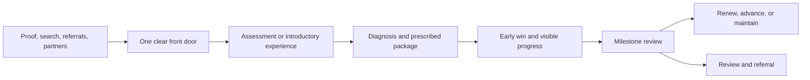

# How In-Person Training Businesses Really Work

## Executive Summary

In-person training businesses are **capacity-constrained, trust-mediated local services**. Their scarce resource is not information; it is a qualified practitioner’s attention, judgment, energy, and schedule. The customer is simultaneously buying three things: a technical outcome, a guided emotional experience, and a recurring practice or identity. Businesses become commoditized when they sell only the appointment.

The strongest default commercial architecture is:

1. **A concrete, defined-end entry** that names the near-term result the customer wants.
2. **A diagnostic core package** priced around the journey and outcome, not a bare hourly rate.
3. **A renewable back end** built around practice, accountability, progression, maintenance, community, or consumables.

The founder’s expertise creates the first referrals and proof, but it also hides weak economics. If the business only works because the founder delivers, sells, attracts clients organically, and accepts below-market pay, the apparent margin is not a replicable unit model.

Growth therefore has two legitimate endpoints. One is a **premium founder-led practice** with deliberately limited capacity, high prices, strong boundaries, and perhaps small groups. The other is a **system-led company** that converts the founder’s method into trainable standards, a skill ladder, management routines, and demand generation that survives without the founder. Confusing these paths produces burnout, premature hiring, or an expensive second location that simply copies the original bottleneck.

The most durable principle across THE WIKI is simple: **standardize the rails, preserve the human moment**. Standardize qualification, assessment, onboarding, lesson architecture, progress tracking, rebooking, follow-up, quality control, and unit economics. Preserve diagnosis, judgment, encouragement, taste, rapport, and the feeling of being seen.

## 1. The industry’s operating anatomy

These businesses look different at the craft level, but their economics are nearly identical.

- **The unit of capacity is a transformation slot.** It may occupy one chair, one mat, one lane, one room, or one instructor-hour. Revenue is bounded by sellable slots × utilization × price, unless the delivery ratio changes.
- **The customer’s result is co-produced.** Attendance, practice, adherence, and trust affect outcomes, so the business must manage customer behavior—not merely perform the technical service.
- **Demand is local and confidence-sensitive.** Proximity helps, but proof, specialization, reputation, and emotional fit can turn a convenience purchase into destination demand.
- **Supply quality is embodied in people.** A bad hire damages results, reviews, referrals, and retention at once. Training and quality assurance are therefore core product infrastructure.
- **The owner has three jobs.** The technician delivers, the manager creates consistency, and the entrepreneur chooses positioning, offers, channels, and the future model. Most solo operators let the technician consume the entire calendar.
- **Growth alternates between demand and supply constraints.** Empty slots require promotion; a full calendar requires pricing, schedule design, group delivery, staff, or a waitlist. Solving the wrong side makes the system worse.

A useful way to view the business is as three nested products:

- **Outcome:** stronger body, better nails, exam score, new skill, confidence, performance, recovery, or artistic competence.
- **Experience:** diagnosis, attention, safety, encouragement, aesthetics, ritual, and social proof.
- **Continuity:** structured practice, accountability, progression, community, maintenance, identity, and sometimes consumable products.

The last two layers are usually where retention and differentiation live.

## 2. Common business models

The models form a ladder of increasing leverage, but “higher” is not automatically better. Each model changes the promise, customer intimacy, staffing burden, and failure mode. A solo premium practice can be an excellent final business if it matches the owner’s goals.

### Business-model ladder

Each model trades intimacy, capacity, standardization, and staffing burden differently.

| Stage | Model | Revenue logic | Best for | Main constraint |
| --- | --- | --- | --- | --- |
| 1 | Premium 1:1 practice | High price × limited founder slots | Cash, proof, learning, craft depth, lifestyle | Founder calendar and energy |
| 2 | Small group / cohort | Several clients per delivery hour | Practice, accountability, peer learning, affordability | Scheduling, group fit, outcome variance |
| 3 | Class or membership studio | Recurring access × utilization | Frequent practice, community, routines, maintenance | Churn, prime-time congestion, fixed costs |
| 4 | Team-delivered studio | Practitioner capacity × average ticket × utilization | Founder-independent service and broader hours | Training, quality, talent retention, management |
| 5 | Education / IP / certification | Method, curriculum, events, media, or certification | Audience leverage and practitioner acquisition | Proof, completion, finite curriculum, founder brand |
| 6 | Products, licensing, or franchise | Consumables, royalties, product margin, or replicated units | Compounding back end and geographic replication | Unit proof, control, capital, compliance, consistency |

## 3. Pricing and offer design

### Price the journey, not the clock

The default hourly or per-session price makes comparison easy and shifts attention to minutes. The stronger approach is to diagnose the starting point, name the target, map the credible journey, and package the required access, milestones, support, and review points. The customer can then compare the offer with the value of the transformation rather than with another practitioner’s hourly rate.

Practical patterns include:

- **Prepaid packages** for a term, quarter, season, or defined program; payment cadence should match the cadence at which value is experienced.
- **Good / better / best tiers** separated by access, speed, group size, scheduling flexibility, feedback, or specialist attention—not artificial feature clutter.
- **Premium 1:1 first** when the owner needs cash, proof, deep customer learning, and a price anchor; introduce groups only after the method is clear.
- **Peak and off-peak pricing** when demand concentrates on evenings, weekends, or popular instructors. Frame quieter periods as a discount rather than apologizing for peak prices.
- **Conditional guarantees** tied to attendance, practice, or adherence. These reverse risk without guaranteeing an outcome the business cannot control.
- **A low-risk front door** such as an assessment, workshop, trial lesson, diagnostic session, or short challenge. Paid entry often qualifies cold traffic better; free trials work when reach and friction reduction matter more than qualification.
- **Defined-end front offers** such as a six-week transformation, exam sprint, technique intensive, or first performance. Customers more readily buy a finish line than an indefinite membership.
- **Continuity only where value renews.** Ongoing billing is credible when the business continually supplies coaching, practice design, community, new progressions, feedback, maintenance, events, or consumables. A finite curriculum forced into a subscription manufactures churn.

Premium pricing works when the difference is operationally visible: a narrower avatar, faster early win, clearer path, better diagnosis, stronger proof, safer method, lower effort, or a meaningfully better experience. Raising price without qualification and delivery evidence merely reduces conversion.

## 4. Customer acquisition

A healthy business does not depend on one channel, even when one channel is dominant. Referrals are powerful but lumpy; social platforms are visible but rented; a good location is helpful but fixed; ads are scalable but amplify weak offers as efficiently as strong ones.

The recurring acquisition sequence is:

1. **Specify the person, situation, pain, and desired scene.** “Music lessons” is generic; “adults who want to play three songs confidently at a family gathering” is concrete.
2. **Show proof in the customer’s language.** Before/after, live demonstration, progress clips, assessment results, reviews, and specific transformation stories outperform technical jargon.
3. **Offer a low-risk next step.** Assessment, paid workshop, trial, consultation, short program, or event.
4. **Capture the relationship.** Move public attention into an owned list, booking database, email, LINE/WhatsApp, or community.
5. **Run a repeatable weekly rhythm.** Leads → appointments → presentations/assessments → sales, with an owner and target at each step.
6. **Add channels after one motion works.** Deepen the current source, improve conversion, then add a new source; novelty is not a strategy.

Local businesses become destination businesses when their position is specific enough that customers will cross the normal convenience radius. Search demand, strong reviews, visible specialization, referral partners, and distinctive proof reduce dependence on expensive frontage.

### Acquisition channel roles

A resilient pipeline combines intent capture, trust transfer, proof, and owned follow-up.

| Sequence | Channel | Primary job | Strength | Failure mode |
| --- | --- | --- | --- | --- |
| 1 | Warm direct outreach | Create first conversations and ask for introductions | Fast, low cash cost, high trust | Finite network; owner avoids selling |
| 2 | Referrals and centers of influence | Borrow trust from clients and complementary professionals | High fit and close rate | Lumpy unless deliberately managed |
| 3 | Local search and reviews | Capture active intent near the buying moment | Strong for destination and urgent demand | Commodity comparison and platform dependence |
| 4 | Content and public proof | Demonstrate expertise, taste, personality, and outcomes | Compounds authority and supports premium pricing | Attention without owned follow-up or a clear offer |
| 5 | Community and events | Create trust, sampling, belonging, and referral moments | Strong for group and identity-based services | Activity without conversion or member quality |
| 6 | Paid advertising | Scale a proven message and front-door offer | Measurable volume and speed | Expensively amplifies weak positioning, offer, or sales follow-up |

## 5. Retention and referral

**The reason to buy is not the reason to stay.** A customer may buy weight loss, exam improvement, a first performance, pain relief, or a visible beauty result. They stay for momentum, accountability, identity, belonging, maintenance, convenience, and trust.

High-retention designs share the same mechanisms:

- **Manual activation before automation.** Watch the first visits closely. Identify the actions that correlate with continuing—assessment completed, schedule committed, first visible win, practice logged, next appointment booked—and make them part of onboarding.
- **Book the next visit before the customer leaves.** Rebooking removes memory and administrative friction. A membership may stabilize revenue, but automatic billing cannot substitute for a compelling next milestone.
- **Make progress legible.** Use a roadmap, skill levels, assessment scores, photos, performance recordings, belt/grade systems, training logs, or treatment plans. Uncertainty feels like lack of value.
- **Create an early win.** Compress the perceived delay to value in the first session or first week.
- **Build a social ritual.** Cohorts, clubs, leagues, showcases, challenges, recitals, member events, parent updates, and peer accountability make the relationship larger than the instructor.
- **Engineer a shareable moment.** A photo, certificate, before/after, first song, personal record, completed project, or progress report gives the customer something natural to recommend.
- **Ask at moments of peak satisfaction.** Use a three-way introduction, guest pass, paired session, or specific invitation rather than a generic “refer a friend.”
- **Segment retention.** Compare renewal by avatar, channel, practitioner, attendance behavior, schedule, and product. The true ideal customer is the one who both benefits and stays.

Over-delivery can reduce retention when it adds unused features, overwhelms customers, or consumes staff time without improving activation. Keep what customers use and what predicts outcomes; remove the rest.

## 6. The operating workflow

The repeatable system should cover the entire customer journey, not only the lesson or service. The craft is one step inside a larger operating loop.

A practical management cadence is:

- **Daily:** schedule, confirmations, no-shows, capacity gaps, cash collected, service issues, and next-day readiness.
- **Weekly:** leads, appointments, assessments, sales, attendance, rebooking, utilization, practitioner capacity, customer risks, reviews, and the next constraint.
- **Monthly:** revenue and gross margin by service/practitioner, average ticket, discounting, cohort retention, referral share, marketing payback, labor ratio, and location-level P&L.
- **Quarterly:** one bottleneck, one major campaign, staffing/capacity plan, price and offer review, and skills/quality audit.

The margin that matters is the margin **after** paying a market wage for delivery, including management, and acquiring customers at a normal cost. Founder unpaid labor, a founder audience, or exceptional personal referrals can make a fragile unit look excellent.

### End-to-end operating workflow

The service itself is one step inside a broader activation, progress, and renewal system.

| Step | Phase | Standardize | Preserve human judgment | Key metric |
| --- | --- | --- | --- | --- |
| 1 | Position and attract | Avatar, trigger, promise, proof formats, weekly channel activity | Story, taste, demonstration, local partnerships | Qualified leads |
| 2 | Qualify and diagnose | Intake, assessment, red flags, goals, fit criteria | Listening, diagnosis, expectation setting | Assessment show rate |
| 3 | Prescribe and sell | Journey map, packages, options, payment, policies | Recommendation and ethical fit decision | Close rate and cash collected |
| 4 | Onboard and activate | Scheduling, baseline, first-win plan, next booking | Confidence, reassurance, personalization | First-value activation |
| 5 | Deliver | Session architecture, safety, preparation, notes, quality checks | Technique adaptation, feedback, rapport | Attendance and quality |
| 6 | Track progress | Milestones, scorecards, photos, recordings, parent/client updates | Interpretation and coaching | Milestone attainment |
| 7 | Rebook and recover | Book-from-booking, reminders, missed-session recovery, risk flags | Barrier resolution and boundary setting | Rebooking and retention |
| 8 | Renew, refer, and advance | Next level, maintenance, community, referral ask, review request | Right next prescription and celebration | Renewal, referral, average client value |

## 7. Growth from solo practitioner to larger business

There are four fundamental ways to move beyond the founder’s calendar:

1. **Raise price while holding supply fixed.** Best for a premium practice; it increases income but not independence.
2. **Change the delivery ratio.** Small groups, classes, cohorts, clinics, camps, or workshops increase revenue per delivery hour.
3. **Productize the method.** Curriculum, assessments, recorded support, templates, content, certification, products, or software separate some value from live time.
4. **Hire and train practitioners.** This is the only route that can make the original service fully founder-independent, but it creates the hardest quality-control and talent-management problem.

The recommended sequence is stage-gated:

- **Proof:** founder sells and delivers to a narrow avatar; capture outcomes, language, objections, and repeatable steps.
- **Premium solo practice:** package the result, protect boundaries, schedule promotion, create rebooking and referrals, and understand real capacity.
- **Systemized practice:** standardize the 80% common path, preserve the 20% requiring judgment, add administrative support, test small-group or junior delivery, and measure quality.
- **Studio / lifestyle boutique:** 4–12 people, clear demand/delivery/operations ownership, practitioner skill ladder, general manager or strong operator, one product ecosystem, one communication system, and a repeatable week.
- **Multi-unit / franchise / license:** only after the flagship produces demand, delivery, management, and profit without hidden founder labor.

Before a second location, the source material repeatedly recommends a founder-removal test: install the manager, let the owner step away for several months, and verify that acquisition, customer experience, staff performance, and profit do not deteriorate. A second site should replicate a working unit, not provide a new place for the founder to be indispensable.

### Founder dependence across growth stages

Directional 1–5 synthesis index; 5 means the business stops without the founder. This is a model, not an industry benchmark.

| Growth stage | Founder dependence (1–5) | Operating leverage (1–5) | Typical team | Primary offer | Next gate |
| --- | ---: | ---: | --- | --- | --- |
| 1 · Proof / apprenticeship | 5 | 1 | 1 | Bespoke 1:1 sessions | Repeatable result and customer language |
| 2 · Premium solo practice | 5 | 2 | 1–2 | Packaged 1:1 transformation | Predictable demand, boundaries, real margins |
| 3 · Systemized practice | 4 | 3 | 2–4 | 1:1 plus groups or junior delivery | Trainable method and consistent quality |
| 4 · Studio / lifestyle boutique | 2 | 4 | 4–12 | Team-delivered core plus client ecosystem | Manager-led unit and founder removal |
| 5 · Multi-unit / franchise / license | 1 | 5 | Multiple units | Replicable operating system | Normalized unit economics and controlled replication |

## 8. Common challenges and constraints

- **Technician trap:** technical competence is mistaken for business competence; selling, finance, hiring, and systems remain “extra work.”
- **Capacity ceiling:** one body, one calendar, prime-time congestion, cancellations, and travel or setup time cap revenue.
- **Energy and burnout:** emotional labor, physical work, creative delivery, and irregular schedules deplete the founder before strategic work begins.
- **Weak demand systems:** the owner relies on referrals, foot traffic, one platform, or seasonal demand and mistakes reputation for a pipeline.
- **Commoditization:** services look equivalent, so buyers compare price and location.
- **Customer-dependent outcomes:** attendance and practice vary, making guarantees, reviews, and perceived value harder to control.
- **Talent dilution:** new practitioners deliver a weaker version of the founder’s “magic”; customers request the owner, and the owner rescues every difficult case.
- **Practitioner churn:** instructors leave with relationships or become competitors unless there is a credible career, income, learning, and leadership path.
- **Fixed-cost risk:** rent, fit-out, equipment, and payroll turn idle capacity into cash burn.
- **Premature complexity:** owners add courses, products, online programs, or second sites before the core acquisition and delivery loop works.
- **False margins:** founder labor, personal brand traffic, and below-market compensation disguise an unrepeatable unit.
- **Continuity mismatch:** billing monthly for a finite curriculum or sporadic value creates avoidable churn.
- **Founder-brand paradox:** the personal brand generates trust faster than the company brand, but it can also make the company harder to transfer or franchise.
- **Data blindness:** total revenue can hide weak practitioners, unprofitable time slots, poor cohorts, discounting, or locations that consume management attention.

## 9. Contradictory strategies—and when each is right

Most contradictions in THE WIKI are not true disagreements; they are advice for different stages, constraints, or owner goals. The controlling questions are: **Is demand or supply binding? Does the owner want a premium practice or a transferable company? Is the customer buying a finite result or renewable value?**

### How to resolve the recurring strategic contradictions

Choose by stage, binding constraint, customer value cycle, and the owner’s intended end state.

| # | Tension | Use the first strategy when | Use the second strategy when | Reconciliation |
| --- | --- | --- | --- | --- |
| 1 | Premium 1:1 vs group scale | The method is unproven, trust is low, or deep learning/cash is needed | The journey is repeatable and peers improve practice or economics | Learn and anchor in 1:1; group the repeatable portions later |
| 2 | Personal brand vs founder-independent company | Founder proof is the fastest path to trust and demand | Transferability, multiple practitioners, or sale value matters | Let the founder lead attention while systems, proof, and delivery belong to the company |
| 3 | Standardization vs personalized craft | Safety, consistency, training, and scale matter | Diagnosis, taste, encouragement, and adaptation drive value | Standardize the rails; preserve the high-judgment human moment |
| 4 | Membership vs defined-end program | Practice, maintenance, community, or progression renews continuously | The buyer needs a concrete finish line or the knowledge is finite | Sell the defined-end result first; renew around genuinely renewable value |
| 5 | Referrals vs predictable paid acquisition | Trust is high, proof is strong, and capacity is still limited | The unit can absorb volume and economics are measured | Engineer referrals, but do not let one source control the pipeline |
| 6 | Free trial vs paid front door | Friction removal and mass sampling are the priority | Cold traffic is unqualified or the core offer is high ticket | Charge enough to create commitment when qualification matters |
| 7 | Prime location vs destination brand | The service is convenient, frequent, and weakly differentiated | Specialization, proof, and reputation justify travel | Treat location as one acquisition channel, not the whole strategy |
| 8 | Open the next location vs maximize the flagship | Demand, delivery, management, and normalized profit already work without the founder | Any of those still depend on founder rescue or hidden subsidy | Expansion follows founder removal; it does not create it |
| 9 | Productize quickly vs stay boutique | The owner wants leverage and a stable method exists | The craft itself is the desired work and scarcity supports premium pricing | Choose the owner’s end state before choosing the model |
| 10 | Accessible low price vs premium price | The model is standardized, high-volume, low-touch, and retention is strong | Capacity is scarce and outcomes require attention or expert labor | Avoid the undifferentiated middle; match price to delivery economics and customer fit |

## 10. A best-practice operating blueprint

1. **Choose the end state.** Decide whether this is a premium craft practice, a bounded lifestyle boutique, or a performance/multi-unit company. Do not inherit “scale” as an unquestioned goal.
2. **Narrow the market.** Define the customer, triggering situation, expensive pain, desired outcome, and proof they will believe.
3. **Name a result.** Turn “sessions” into a credible journey with a finish line, milestones, and an early win.
4. **Build the offer stack.** Low-risk front door → core transformation package → renewable practice/maintenance/community → optional products, events, advanced levels, or certification.
5. **Protect unit economics.** Price after diagnosis, collect enough cash early to fund delivery and acquisition, and calculate margin after replacement labor and normal marketing.
6. **Own a weekly acquisition motion.** Start with direct outreach, content, local search/reviews, referral partners, and deliberate referral asks. Add paid acquisition once the offer and conversion path are proven.
7. **Instrument activation.** Define the first-value event, book the next session, make progress visible, and intervene early when attendance or practice drops.
8. **Design referrals into delivery.** Create a result worth showing, a moment worth sharing, and a simple introduction mechanism.
9. **Systemize in the right order.** Specialize the target and outcome; standardize the repeatable path; simplify it for training. Document after observing what works.
10. **Hire against the current constraint.** Administrative help protects high-value founder energy; junior practitioners expand supply; marketing/sales help expands demand; management becomes necessary when coordination is the bottleneck.
11. **Create a practitioner ladder.** Tie skills, quality, retention, reviews, client capacity, title, and compensation to visible progression. Give strong people a path to leadership or internal entrepreneurship.
12. **Expand only after founder removal.** The flagship must sustain demand, delivery, management, and economics without the founder’s invisible subsidy.

The highest-leverage near-term diagnostic is a one-page scorecard with: leads, booked assessments, show rate, close rate, active clients, attendance, rebooking, retention/renewal, referrals, average ticket, utilization by prime/off-peak time, delivery labor, marketing spend, cash collected, and contribution profit. Review it weekly and fix only the current bottleneck.

## 11. Further questions

For a specific business in this industry, the next learning pass should answer:

- What exact transformation and customer situation create the highest willingness to pay?
- Which customers get the best outcomes **and** retain the longest?
- What is the true capacity by practitioner, room, chair, lane, and prime-time slot?
- Which actions in the first two visits predict renewal?
- What part of the founder’s method is teachable, and what part is judgment, taste, or relationship?
- Does the business still make money after paying a replacement practitioner, manager, and normal customer acquisition cost?
- Is recurring billing supported by recurring value, or is it merely convenient for the seller?
- Which referral partners already own the trust of the ideal customer?
- What would have to be true for the owner to disappear for three months without performance declining?
- Which growth path best fits the owner’s desired life: premium solo, small-group studio, lifestyle boutique, education/IP layer, or multi-unit system?

## 12. Caveats and evidence boundaries

This is a qualitative industry synthesis of THE WIKI as of **14 July 2026**, not a statistical survey of the global market. Dollar figures, margin examples, team-size heuristics, and timelines in the source material are illustrative and context-dependent; they are not presented here as universal benchmarks.

The evidence base combines distilled notes with underlying raw transcripts, a full-text business book, course modules, and operating worksheets. Closely related material was de-duplicated where the vault contained substantively identical transcript content. Some sources are single-author frameworks or promotional business content, so convergence across independent cases was weighted more heavily than any one person’s rule.

The report spans professions with shared economics but different regulation, injury risk, safeguarding obligations, licensing, labor rules, and customer behavior. Nail services, personal training, tutoring, yoga, music, dance, language instruction, swimming, and martial arts should share the operating architecture—not necessarily the same prices, guarantees, staffing model, or legal structure.

The founder-dependence chart is a **directional synthesis index**, not measured industry data. It exists to show the strategic transition described across the sources.

## Source base reviewed

This report synthesizes the relevant local-service, training, studio, education, pricing, acquisition, retention, operations, and scaling material across THE WIKI, including:

- 阿金創業解惑社 Q&A cases
- Alex Hormozi AMA and Cash Cow business-breakdown transcripts
- The $100M series summary
- Michael E. Gerber’s The E-Myth Revisited
- Daniel Priestley’s lifestyle-business, oversubscription, LAPS, proof-to-IP, and business-growth material
- The 連鎖經營學 course modules and operating worksheets
- Will Barron’s service-business sales-system material
- THE WIKI’s distilled strategy, tactics, frameworks, research, and related articles

The file intentionally contains no wiki links and is not linked from any other note.

For this business type, a great funnel is:

````

````

The core principle is:

- Attract with a specific desired result.
- Convert through diagnosis and prescription.
- Fulfill through a standardized journey with personal coaching.
- Retain by making progress and the next stage obvious.

## 1. Attract

The goal is not maximum leads. It is qualified people booking the right introductory step.

### Best practices

**Own a narrow customer and situation**

Avoid “personal training,” “music lessons,” or “English tutoring.” Use a specific person, trigger, and outcome:

- Busy professionals rebuilding strength after years of inactivity
- High-school students preparing for competitive university programs
- Adult beginners who want to play three songs confidently
- Women seeking durable premium nail designs for special events
- Children preparing for their first swim competition

Specificity improves proof, referrals, search visibility, advertising, and pricing simultaneously.

**Lead with the customer’s desired scene**

Show what life looks like afterward:

- A visible before-and-after
- A student’s score improvement
- A first song or recital
- A completed movement
- A belt, grade, certificate, or personal record
- A distinctive nail transformation

Technical credentials support the claim, but the transformation should lead.

**Use multiple entrances into one front door**

The strongest channel mix is:

|Channel|Best use|
|---|---|
|Referrals|Borrow trust from delighted clients|
|Local search and reviews|Capture people already looking|
|Content|Demonstrate expertise, personality, and proof|
|Referral partners|Reach customers through trusted professionals|
|Community/events|Let prospects experience the method|
|Direct outreach|Fill early capacity inexpensively|
|Paid advertising|Scale a funnel already proven organically|

Referral partners might include schools, physiotherapists, pediatricians, gyms, community organizations, employers, cafés, complementary beauty professionals, or sporting clubs.

**Build one repeatable front-door offer**

Good options include:

- Initial assessment
- Trial lesson
- Technique evaluation
- Paid introductory workshop
- Short challenge
- Beginner intensive
- Style consultation
- Exam-readiness assessment

Cold or poorly qualified traffic often benefits from a small paid commitment. Free trials make more sense when the service is easy to sample, capacity is available, and qualification is less important.

### What the landing page should say

1. Who it is for
2. The result or problem
3. Relevant proof
4. How the process works
5. What the introductory step includes
6. A single booking action

A weak CTA is “Contact us” or “Request a quote.” A stronger CTA is “Book your movement assessment” or “Reserve your beginner piano session.”

### Primary metrics

- Qualified leads by channel
- Assessment bookings
- Cost per qualified booking
- Referral and review-generated leads
- Landing-page-to-booking conversion
- Available capacity versus incoming demand

If the calendar is already full, attracting more leads is not the priority. Use a waitlist, higher prices, off-peak incentives, groups, or additional trained capacity.

---

## 2. Convert

The best conversion method is diagnostic selling: understand, assess, prescribe, and then price the complete journey.

### The ideal conversion process

**1. Respond quickly**

Confirm the inquiry, explain the next step, answer basic concerns, and reduce uncertainty. Automation can confirm the booking, but personal contact is valuable for high-ticket or anxiety-sensitive services.

**2. Qualify before consuming scarce capacity**

Confirm:

- The customer’s goal
- Urgency or triggering event
- Current condition or skill level
- Schedule and attendance feasibility
- Decision-maker involvement
- Budget or willingness to invest
- Whether the practitioner can safely and credibly help

For children’s services, the parent is usually the buyer even though the child is the user. Both need to be sold differently.

**3. Conduct a real assessment**

A good assessment produces value even before the purchase:

- Establish the baseline
- Clarify the desired result
- Expose the gap
- Identify obstacles
- Demonstrate expertise
- Provide one useful insight or early win

The prospect should leave understanding their problem more clearly than before.

**4. Prescribe the journey**

The structure is:

> “You are here. You want to reach there. These are the obstacles. Based on what I saw, this is the program I recommend.”

This is more credible than asking, “How many sessions would you like?”

**5. Present two or three genuine options**

For example:

- Core: standard program and schedule
- Accelerated: greater frequency or smaller group
- Premium: 1:1 access, flexible scheduling, additional feedback

Differentiate options by access, speed, frequency, group size, feedback, or convenience—not arbitrary bonuses.

**6. Sell a package, not disconnected appointments**

Examples:

- Six-week beginner program
- Twelve-session transformation
- One academic term
- Annual examination package
- Three-month technique intensive
- Initial nail set plus scheduled maintenance
- Seasonal training block

Prepayment or a structured payment plan improves commitment, attendance, cash flow, and scheduling predictability.

**7. Reverse risk conditionally**

A guarantee should depend on customer behavior:

> Attend the agreed sessions, complete the practice, and follow the plan. If the milestone is not reached, we will continue helping at no additional charge for a defined period.

Do not guarantee outcomes outside the business’s control.

### Primary metrics

- Lead response time
- Assessment show rate
- Assessment-to-sale conversion
- Cash collected per assessment held
- Average initial package value
- Conversion by channel and customer type
- Reasons for losing qualified prospects

The best high-level conversion measure is often:

> **Cash collected ÷ completed assessments**

This prevents the business from celebrating high close rates created by underpricing.

---

## 3. Fulfill

Fulfillment should feel personal to the customer while being operationally repeatable behind the scenes.

### The 80/20 delivery model

Standardize the repeatable 80%:

- Intake
- Baseline assessment
- Safety checks
- Session preparation
- Lesson or appointment architecture
- Progress milestones
- Notes and records
- Scheduling and reminders
- Quality-control standards
- Missed-session recovery
- Parent or client updates

Preserve the high-judgment 20%:

- Diagnosis
- Technique correction
- Emotional encouragement
- Creative taste
- Adaptation to the customer
- Relationship and rapport
- Deciding when to accelerate or slow down

This is what “standardize the rails, preserve the human moment” means.

### Create activation immediately

The first one or two experiences should accomplish four things:

1. Confirm that the customer made the right decision
2. Produce a noticeable early win
3. Explain the complete journey
4. Secure the next appointment or schedule

Examples of early wins:

- Improved movement during the first assessment
- Playing part of a song
- Solving a previously confusing exam problem
- Completing a first technique safely
- Seeing an immediate aesthetic transformation
- Receiving a clear personalized roadmap

### Prebook the journey

Whenever possible:

- Schedule the program in advance
- Book the next appointment before the customer leaves
- Establish cancellation and rescheduling rules
- Send reminders
- Follow up immediately after a missed session
- Protect prime-time capacity

Do not leave continuation dependent on the customer remembering to contact the business.

### Make progress visible

Use the format appropriate to the profession:

- Photos
- Assessment scores
- Skill levels
- Training logs
- Practice streaks
- Recordings
- Grades or belts
- Parent progress reports
- Completed projects
- Performance events

Progress visibility simultaneously improves motivation, retention, referrals, testimonials, and perceived value.

### Manage customer behavior

Because results are co-produced, the service should include:

- Attendance accountability
- Practice expectations
- Progress check-ins
- Recovery after missed work
- Clear client responsibilities
- Escalation for at-risk customers

### Primary metrics

- Activation or first-value completion
- Attendance rate
- Time to first milestone
- Milestone achievement
- Rebooking before departure
- Practitioner utilization
- Service issues and corrections
- Customer results by practitioner
- Retention by customer type and acquisition channel

---

## 4. Retain and expand

Retention should not be “keep buying the same sessions forever.” It should be the natural next prescription.

### Conduct a milestone review before the program ends

Do not wait for the final session. Review:

- Where the customer started
- What has changed
- What remains unresolved
- What they can now do
- What the next desirable milestone is
- What happens if they stop completely

Then prescribe one of three paths:

1. **Advance:** pursue the next skill or result
2. **Maintain:** preserve the current result
3. **Graduate:** leave successfully with an open return path

Graduation is not always failure. A business can generate strong referrals and future reactivation by completing a customer’s original journey honestly.

### Build renewable value

Continuity works when the value itself renews:

- Continued practice
- Accountability
- New progressions
- Coaching feedback
- Community
- Competitions or performances
- Maintenance
- New designs or seasonal styles
- Access to facilities
- Fresh curriculum
- Consumable products

A finite curriculum placed behind permanent monthly billing will eventually create churn.

### Use a progression ladder

A strong customer ladder might be:

> Introductory experience → core transformation → ongoing practice → advanced level → events/certification/products

Examples:

|Business|Initial result|Retention/expansion|
|---|---|---|
|Personal training|Six-week strength or weight goal|Ongoing coaching, group training, advanced performance|
|Tutoring|Exam-readiness sprint|Term/year package, advanced subject, study-skills support|
|Music|Play three songs|Repertoire club, ensemble, recital preparation|
|Martial arts|Beginner foundations|Belt progression, competition team, camps|
|Nail services|Signature first set|Prebooked maintenance, seasonal designs, priority membership|
|Yoga|Beginner mobility program|Practice membership, workshops, retreats, teacher training|
|Swim coaching|Water confidence|Stroke development, squad, competition preparation|

### Engineer referrals into the experience

A referral needs:

- A result worth discussing
- A moment worth sharing
- An easy mechanism

Examples:

- Progress photo
- Certificate
- First-performance recording
- Personal-record card
- Student improvement report
- Guest session
- Paired lesson
- Three-way introduction
- Client showcase or recital

Ask when satisfaction is highest, not several weeks later.

### Expand carefully

Expansion should solve the customer’s next problem:

- Higher frequency
- Advanced level
- Smaller group or private access
- Events and camps
- Equipment or products
- Adjacent subjects or techniques
- Family packages
- Certification
- Maintenance programs

Avoid adding unrelated products merely to increase revenue.

### Primary metrics

- Rebooking rate
- Package completion
- Renewal or advancement rate
- Client retention by cohort
- Referral rate
- Reviews generated
- Revenue per active client
- Expansion revenue
- Reactivation of former clients
- Retention by practitioner

## The complete “great funnel”

A clean version looks like this:

1. Customer sees specific proof through search, content, referral, or a partner.
2. They land on one outcome-specific page.
3. They book an assessment, trial, or short introductory program.
4. The business responds and qualifies them.
5. The practitioner establishes the baseline and desired outcome.
6. The practitioner prescribes a defined package.
7. The customer pays and prebooks the journey.
8. The first experience creates an early win.
9. Progress is measured and communicated.
10. Missed attendance triggers intervention.
11. A milestone review occurs before the package ends.
12. The customer advances, maintains, or graduates.
13. A review and referral are requested at peak satisfaction.
14. The customer enters the appropriate next level—not an indefinite generic membership.

The most important transition is between fulfillment and retention. If the customer cannot clearly see both the progress already made and the next valuable milestone, no amount of automated follow-up will create durable retention.

