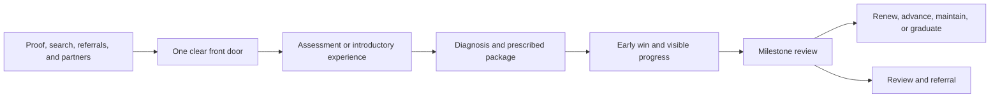

# How In-Person Training Businesses Really Work

## Derivation roots

- [[01-Business-Strategy/Business Strategy Index|Business Strategy]]
- [[03-Tactics-and-Playbooks/Tactics and Playbooks Index|Tactics and Playbooks]]
- [[04-Frameworks-and-Mental-Models/Frameworks and Mental Models Index|Frameworks and Mental Models]]
- [[05-Intelligence-and-Research/Intelligence and Research Index|Intelligence and Research]]
- [[06-Source-Library/Source Library Index|Source Library]]

## Executive Summary

In-person training businesses are **capacity-constrained, trust-mediated local services**. Their scarce resource is not information; it is a qualified practitioner's attention, judgment, energy, and schedule. The customer is simultaneously buying three things: a technical outcome, a guided emotional experience, and a recurring practice or identity. Businesses become commoditized when they sell only the appointment.

The strongest default commercial architecture is:

1. **A concrete, defined-end entry** that names the near-term result the customer wants.
2. **A diagnostic core package** priced around the journey and outcome, not a bare hourly rate.
3. **A renewable back end** built around practice, accountability, progression, maintenance, community, or consumables.

The founder's expertise creates the first referrals and proof, but it also hides weak economics. If the business only works because the founder delivers, sells, attracts clients organically, and accepts below-market pay, the apparent margin is not a replicable unit model.

Growth therefore has two legitimate endpoints. One is a **premium founder-led practice** with deliberately limited capacity, high prices, strong boundaries, and perhaps small groups. The other is a **system-led company** that converts the founder's method into trainable standards, a skill ladder, management routines, and demand generation that survives without the founder. Confusing these paths produces burnout, premature hiring, or an expensive second location that simply copies the original bottleneck.

The most durable principle across THE WIKI is simple: **standardize the rails, preserve the human moment**. Standardize qualification, assessment, onboarding, lesson architecture, progress tracking, rebooking, follow-up, quality control, and unit economics. Preserve diagnosis, judgment, encouragement, taste, rapport, and the feeling of being seen.

## 1. The industry's operating anatomy

These businesses look different at the craft level, but their economics are nearly identical.

- **The unit of capacity is a transformation slot.** It may occupy one chair, one mat, one lane, one room, or one instructor-hour. Revenue is bounded by sellable slots × utilization × price, unless the delivery ratio changes.
- **The customer's result is co-produced.** Attendance, practice, adherence, and trust affect outcomes, so the business must manage customer behavior—not merely perform the technical service.
- **Demand is local and confidence-sensitive.** Proximity helps, but proof, specialization, reputation, and emotional fit can turn a convenience purchase into destination demand.
- **Supply quality is embodied in people.** A bad hire damages results, reviews, referrals, and retention at once. Training and quality assurance are therefore core product infrastructure.
- **The owner has three jobs.** The technician delivers, the manager creates consistency, and the entrepreneur chooses positioning, offers, channels, and the future model. Most solo operators let the technician consume the entire calendar.
- **Growth alternates between demand and supply constraints.** Empty slots require promotion; a full calendar requires pricing, schedule design, group delivery, staff, or a waitlist. Solving the wrong side makes the system worse.

A useful way to view the business is as three nested products:

- **Outcome:** stronger body, better nails, exam score, new skill, confidence, performance, recovery, or artistic competence.
- **Experience:** diagnosis, attention, safety, encouragement, aesthetics, ritual, and social proof.
- **Continuity:** structured practice, accountability, progression, community, maintenance, identity, and sometimes consumable products.

The last two layers are usually where retention and differentiation live.

### One constraint at a time, and three functions to staff it

The demand/supply alternation is not a mood; it is a diagnosis with a hiring consequence. At any moment the business is bound by one side, and effort spent on the other side does not move the system. Three functions must exist regardless of headcount — **promote** (create customers, including conversion), **deliver** (perform the service), and **operate** (run the day-to-day, standards, and coordination) — and the right hire is whichever function relieves the *current* constraint, not whichever role an org chart suggests. A studio that is supply-constrained cannot market its way out; a studio that is demand-constrained does not need another instructor yet.

One exception to pure present-focus: a genuinely existential future constraint — an expiring lease, a landlord conversion, a licensing change — must be planned in parallel even while today's bottleneck is elsewhere.

### The four levels of customer need

Willingness to pay, urgency, and tolerance for price comparison all track how urgent the customer's underlying need is. A useful diagnostic sorts demand into four levels:

| Level | Customer state | Examples in this industry | Commercial character |
| --- | --- | --- | --- |
| **Rescue** | Something is failing right now | Exam three weeks away; acute pain limiting work; a wedding in a month | Highest urgency and willingness to pay; least price comparison; short time horizon |
| **Cure** | A defined problem needs fixing | Post-injury return to movement; a failing subject; a technique that has plateaued | High willingness to pay; buys a defined-end program readily |
| **Wellness** | Maintaining and improving a working state | General fitness, ongoing music practice, regular nail maintenance | Moderate willingness to pay; buys continuity and routine; price-sensitive without differentiation |
| **Building** | Constructing a long-term capability or identity | Competition athlete development, conservatory-track training, black-belt path | Long horizon and high lifetime value, but slow to start and requires visible progression |

Two practical uses. First, the entry offer should usually be pitched at the most urgent level a customer credibly occupies, and the back end at the level below it — rescue and cure sell the defined-end program, wellness and building sustain the renewable one. Second, the same diagnostic applies to the *operator*: a business whose cash will not survive the quarter is at the rescue level and should not be spending its attention on brand refinement or a second location, which are wellness- and building-level problems.

### Why a fully booked schedule still runs badly

Capacity in these businesses is a chain of dependent events with real variation: clients arrive late, sessions overrun, no-shows appear, rooms and equipment turn over, practitioners need recovery between blocks. When every slot in the prime-time window is sold at 100% of nominal capacity, normal variation has nowhere to go — a shortfall in one slot cannot be recovered by a later slot that is already full, so delays and unfilled gaps accumulate across the evening rather than averaging out.

The operational consequence is that **average capacity equal to average demand is not enough**. A schedule needs deliberate protective capacity: buffer slots in the prime window, a defined turnover gap, and a waitlist that functions as the buffer that refills cancellations quickly. This is also why "just add more clients" degrades a full studio's quality and reviews before it raises its revenue, and why prime-time congestion appears in Section 11 as a structural constraint rather than a scheduling annoyance.

## 2. Common business models

The models form a ladder of increasing leverage, but "higher" is not automatically better. Each model changes the promise, customer intimacy, staffing burden, and failure mode. A solo premium practice can be an excellent final business if it matches the owner's goals.

### Business-model ladder

Each model trades intimacy, capacity, standardization, and staffing burden differently.

| Stage | Model | Revenue logic | Best for | Main constraint |
| --- | --- | --- | --- | --- |
| 1 | Premium 1:1 practice | High price × limited founder slots | Cash, proof, learning, craft depth, lifestyle | Founder calendar and energy |
| 2 | Small group / cohort | Several clients per delivery hour | Practice, accountability, peer learning, affordability | Scheduling, group fit, outcome variance |
| 3 | Class or membership studio | Recurring access × utilization | Frequent practice, community, routines, maintenance | Churn, prime-time congestion, fixed costs |
| 4 | Team-delivered studio | Practitioner capacity × average ticket × utilization | Founder-independent service and broader hours | Training, quality, talent retention, management |
| 5 | Education / IP / certification | Method, curriculum, events, media, or certification | Audience leverage and practitioner acquisition | Proof, completion, finite curriculum, founder brand |
| 6 | Products, licensing, or franchise | Consumables, royalties, product margin, or replicated units | Compounding back end and geographic replication | Unit proof, control, capital, compliance, consistency |

Two points about stage 6 that the ladder's shape can obscure. Franchising and licensing are usually experienced as acceleration, but structurally they are **financing decisions** — the franchisor gives away nearly all of a unit's economics in exchange for a royalty, which makes franchising among the most expensive capital available. It is the right instrument when geographic expansion genuinely cannot be funded another way, and the wrong one when the real motivation is speed. And a service business at stage 4 or above is, in operating terms, a **teaching business**: its profit is the gap between the value of the people it can hire and the value of the delivery they produce after training, which makes recruiting, onboarding, and training the core competency rather than a support function.

## 3. Pricing and offer design

### Price the journey, not the clock

The default hourly or per-session price makes comparison easy and shifts attention to minutes. The stronger approach is to diagnose the starting point, name the target, map the credible journey, and package the required access, milestones, support, and review points. The customer can then compare the offer with the value of the transformation rather than with another practitioner's hourly rate.

Practical patterns include:

- **Prepaid packages** for a term, quarter, season, or defined program; payment cadence should match the cadence at which value is experienced.
- **Good / better / best tiers** separated by access, speed, group size, scheduling flexibility, feedback, or specialist attention—not artificial feature clutter.
- **Premium 1:1 first** when the owner needs cash, proof, deep customer learning, and a price anchor; introduce groups only after the method is clear.
- **Peak and off-peak pricing** when demand concentrates on evenings, weekends, or popular instructors. Frame quieter periods as a discount rather than apologizing for peak prices.
- **Conditional guarantees** tied to attendance, practice, or adherence. These reverse risk without guaranteeing an outcome the business cannot control.
- **A low-risk front door** such as an assessment, workshop, trial lesson, diagnostic session, or short challenge. Paid entry often qualifies cold traffic better; free trials work when reach and friction reduction matter more than qualification.
- **Defined-end front offers** such as a six-week transformation, exam sprint, technique intensive, or first performance. Customers more readily buy a finish line than an indefinite membership.
- **Continuity only where value renews.** Ongoing billing is credible when the business continually supplies coaching, practice design, community, new progressions, feedback, maintenance, events, or consumables. A finite curriculum forced into a subscription manufactures churn.

Premium pricing works when the difference is operationally visible: a narrower avatar, faster early win, clearer path, better diagnosis, stronger proof, safer method, lower effort, or a meaningfully better experience. Raising price without qualification and delivery evidence merely reduces conversion.

### Big head, long tail

The last pattern above has a shape worth naming, because it is the most common structural pricing error in this industry. The **one-time transformation** — the thing that is genuinely valuable once and then permanently owned by the customer — should carry a high price relative to its value ("the big head"). The **genuinely recurring component** — practice, access, feedback, community, maintenance, fresh material — should carry a much lower recurring price ("the long tail"), and that asymmetry is correct rather than a failure to monetize.

The failure mode is selling a large one-time value as an indefinite monthly payment. The first month feels excellent to the buyer, because they receive the whole transformation; every subsequent month is really buying the continuity layer at a price set for the transformation, and they cancel. A high one-time price also supports the back end psychologically: having invested substantially in the result, customers are reluctant to abandon the small subscription that maintains it.

### Finding the price band before setting a price

Most operators set price by feel, by copying the studio down the road, or by what they believe they deserve. A defensible alternative is to survey real prospects in the target segment with four questions:

1. At what price would this be **so expensive** you would not consider it?
2. At what price would it be **so cheap** that you would doubt it could be any good?
3. At what price would it be **expensive but still worth considering** — you would have to think, but you would buy?
4. At what price would it be a **clear bargain**?

Plotted as cumulative curves, the answers yield a floor (below which price signals poor quality) and a ceiling (above which the offer is dismissed). Price inside the band, nearer the top when a person sells with real conversation and friction, nearer the sales-maximizing point when the purchase is self-serve. Capture a few respondent characteristics alongside the four answers so the curve can be cut by segment — if it shows two humps, that is two customer types and two offers, not one compromise price.

### The guarantee toolkit

Risk is the largest single objection to a training purchase, and a guarantee only has force when it names a concrete consequence: *if you do not get X within Y, we will do Z*. Four families are available, and the choice should follow price point and delivery cost rather than nerve:

| Type | Structure | Best fit in this industry |
| --- | --- | --- |
| **Unconditional** | Refund for any reason within a short window | Low-price trials, workshops, and intro classes |
| **Conditional** | Continued work or refund only if the customer attended, practiced, and followed the plan and still fell short | The default for core packages — screens for commitment and improves results |
| **Anti-guarantee** | All sales final, with a credible reason | Consumable or immediately-delivered work such as a completed nail set |
| **Performance** | Payment tied to a measured result | Rare here; only where the outcome is genuinely measurable and mostly within the practitioner's control |

Two disciplines make guarantees safe. Decide by arithmetic, not fear: a stronger guarantee that raises sales by more than it raises refunds still nets more collected cash, and refund rates in well-delivered services are typically low. And make the guarantee's conditions the exact behaviors the best customers already exhibit — attendance, practice, adherence — so that the guarantee simultaneously sells the package and engineers the result. Because delivery cost per session is high in this industry, unconditional refunds on long programs are the one family to use sparingly.

## 4. Unit economics: turning the advice into numbers

Every recommendation above eventually has to survive arithmetic. Three numbers decide whether a training business can grow without running out of cash, and a fourth decides whether the founder's apparent profit is real.

- **LTV (lifetime value):** total revenue a customer generates across their whole relationship, converted to gross profit by subtracting the cost of delivering it — which in this industry means the practitioner's time at a market wage, whether or not the founder currently pays it.
- **CAC (customer acquisition cost):** everything spent to convert attention into a paying client — advertising, referral incentives, the assessment slots consumed by prospects who did not buy, and the sales time itself.
- **Payback period:** how long it takes to recover the CAC **in cash**, not on paper.
- **Normalized margin:** the margin remaining after paying a market wage for delivery *and* management, and acquiring customers at a normal cost.

Two working rules make these usable. An **LTV(gross profit)-to-CAC ratio of roughly 3:1** is the point at which businesses in the vault's source material generally become able to scale; below it, growth consumes cash faster than it produces it, and well above it the business is usually under-spending on acquisition rather than being unusually healthy. Separately, the **30-day rule**: if cash collected in the first thirty days exceeds CAC plus the cost of fulfilling that first thirty days, each customer funds the acquisition of the next one, and cash stops being the ceiling on growth.

### A worked illustration

The figures below are invented to show the arithmetic, not to serve as benchmarks. Substitute real numbers before making any decision.

Consider a studio selling a twelve-session, six-week transformation package.

| Line | Package model | Per-session model |
| --- | --- | --- |
| Price | $1,200 prepaid | $110 per session |
| Cash collected in first 30 days | $1,200 | ~$220 (two sessions) |
| Delivery cost in first 30 days (practitioner at market wage) | $400 | $80 |
| CAC | $430 | $430 |
| First-30-day cash minus (CAC + 30-day delivery) | **+$370** | **−$290** |

Both models can be profitable over a customer's lifetime. Only the first one finances its own growth. The per-session studio has to fund acquisition out of savings or borrowing while revenue trickles in, which is why it tends to feel permanently cash-starved even when the trailing P&L looks acceptable — and why its owner concludes that advertising "doesn't work" when the real constraint is payment structure.

This is the strongest argument for prepaid, defined-end packages, and it is an argument about financing rather than commitment. Section 3's advice to price the journey and Section 6's advice to secure prepayment are, economically, the same recommendation.

Extending the same example: if lifetime gross profit per client is roughly $1,300 across the core package and typical renewals, the 3:1 rule puts maximum sustainable CAC near $430 — consistent with the rule of thumb of spending up to about a third of lifetime value to acquire a customer. That single number then governs how much can be spent on advertising, referral rewards, and unconverted assessments, and it is the number most operators have never calculated.

### Financial instrumentation

Numbers only discipline a business if they are produced on a rhythm.

- **Daily unit P&L.** Net revenue − direct delivery cost = gross profit − operating expenses = today's operating result, accumulated for the month alongside it. The point is to make "did we make money today?" a question with an answer, rather than a discovery at month end.
- **Zero-based budgeting.** Build each period's expense budget from the plan and its intended result, not by extrapolating last year. The governing question is: what will this money buy, and what result should it produce?
- **A cash-runway table.** Opening balance + expected receipts − committed outflows = closing balance, with a standing rule that the closing balance must exceed the next three months of committed outflows. Below that line, financing or collection needs to be arranged in advance rather than in an emergency.
- **Separate revenue and expense flows.** Do not let takings and disbursements mix in the same cash movement; separation reduces both error and the opportunity for loss.

## 5. Attract: Customer acquisition

The goal is not maximum leads. It is to get qualified people to book the right introductory step. A healthy business does not depend on one channel, even when one channel is dominant: referrals are powerful but lumpy; social platforms are visible but rented; a good location is helpful but fixed; and paid advertising scales weak offers as efficiently as strong ones.

### Own a narrow customer and situation

Avoid positioning the business as generic "personal training," "music lessons," or "English tutoring." Define a specific person, trigger, and outcome:

- busy professionals rebuilding strength after years of inactivity;
- high-school students preparing for competitive university programs;
- adult beginners who want to play three songs confidently;
- women seeking durable premium nail designs for special events;
- children preparing for their first swim competition.

Specificity improves proof, referrals, search visibility, advertising, and pricing at the same time. Local businesses become destination businesses when the position is strong enough that customers will cross the normal convenience radius. Search demand, reviews, visible specialization, referral partners, and distinctive proof reduce dependence on expensive frontage.

### Read the trade area before signing the lease

For a location-based business, the catchment is a commercial input, not a matter of taste. A trade area is conventionally drawn as a radius of roughly one kilometre around the site, adjusted for transport routes, stations, roads, and physical barriers, and split into a primary catchment that supplies most visits and a secondary catchment that supplies the remainder.

Six indicators grade a candidate area: the number and tier of brands present, foot traffic, commercial floor area, transport access, local spending power, and rent levels. Four further dimensions should be applied together rather than singly — geographic reach (city-wide, sub-district, or neighborhood), functional character (general, specialist, or destination), spending tier, and stage of development (mature, growing, or declining). A site that is excellent on rent and traffic but sits in a declining catchment is a different proposition from the same site in a growing one.

The base character of the area also predicts the shape of demand: office areas concentrate weekday daytime volume, commercial areas swing with weekends and events, residential areas produce steady everyday frequency. A studio that sells evening 1:1 sessions and a studio that sells weekday lunchtime classes want different catchments.

A practical survey checklist before committing: address and map, transport routes and stops, resident population, passing traffic, spending power, area character, direct competitors, businesses at a similar price position, prevailing rent, operating cost, the revenue required to break even, seasonal peaks and troughs, and any restrictions on operating there.

### Lead with the customer's desired scene

Show what life looks like after the service:

- a visible before-and-after;
- a student's score improvement;
- a first song or recital;
- a completed movement;
- a belt, grade, certificate, or personal record;
- a distinctive nail transformation.

Technical credentials support the claim, but the transformation should lead. Proof in the customer's language—a live demonstration, progress clip, assessment result, review, or specific result story—usually communicates value better than technical jargon.

### The studio is the studio

An operating training business has a content advantage that online-only competitors cannot manufacture: the work itself is visible, and the premises are a credible set. Filming where the work actually happens — corrections in progress, a first successful repetition, the honest daily problems of running the place — proves reality in a way a rented backdrop cannot, and requires no production budget.

Two consequences follow. The content skill and the advertising skill are the same skill, so an owner who learns to hold attention organically also learns to buy it. And for a location-based business, the single highest-leverage paid channel is usually **tight-radius local advertising** — social ads geo-fenced to roughly the catchment identified above — rather than broad campaigns, because the offer is only purchasable by people who can physically attend.

### Go to the catchment instead of waiting in it

Passive footfall is the weakest form of local demand. Two active motions consistently outperform it:

- **Institutional outreach.** Systematically inventory the offices, schools, and employers inside the catchment, approach them directly, and establish a standing preferential arrangement — a corporate rate, an on-site introductory session, a staff-wellbeing slot. This converts an anonymous radius into a named list.
- **Strategic alliances.** Partner with non-competing businesses serving the same customer at a different moment — a physiotherapy clinic, a school, a café, a complementary beauty professional — so that trust transfers at the point where the need becomes visible.

Marketing effort also splits usefully into a broad brand layer that establishes position and recognition and a local activation layer executed at the site; as a planning heuristic, most of the message should be consistent and centrally decided, with a meaningful minority adapted to the specific catchment.

### Run one acquisition sequence

1. **Specify the person, situation, pain, and desired scene.**
2. **Show relevant proof.**
3. **Offer a low-risk next step.** Assessment, paid workshop, trial, consultation, short program, or event.
4. **Capture the relationship.** Move attention into a booking database, email list, messaging channel, or community.
5. **Run a weekly rhythm.** Leads → appointments → assessments/presentations → sales, with an owner and target at each step.
6. **Add channels after one motion works.** Deepen the current source and improve conversion before adding novelty.

### Acquisition channel roles

A resilient pipeline combines intent capture, trust transfer, proof, and owned follow-up.

| Sequence | Channel | Primary job | Strength | Failure mode |
| --- | --- | --- | --- | --- |
| 1 | Warm direct outreach | Create first conversations and ask for introductions | Fast, low cash cost, high trust | Finite network; owner avoids selling |
| 2 | Referrals and centers of influence | Borrow trust from clients and complementary professionals | High fit and close rate | Lumpy unless deliberately managed |
| 3 | Local search and reviews | Capture active intent near the buying moment | Strong for destination and urgent demand | Commodity comparison and platform dependence |
| 4 | Content and public proof | Demonstrate expertise, taste, personality, and outcomes | Compounds authority and supports premium pricing | Attention without owned follow-up or a clear offer |
| 5 | Community and events | Create trust, sampling, belonging, and referral moments | Strong for group and identity-based services | Activity without conversion or member quality |
| 6 | Paid advertising | Scale a proven message and front-door offer | Measurable volume and speed | Expensively amplifies weak positioning, offer, or sales follow-up |

Referral partners might include schools, physiotherapists, pediatricians, gyms, community organizations, employers, cafés, complementary beauty professionals, and sporting clubs.

### Build one repeatable front door

Good entry offers include:

- an initial assessment;
- a trial lesson;
- a technique evaluation;
- a paid introductory workshop;
- a short challenge;
- a beginner intensive;
- a style consultation;
- an exam-readiness assessment.

Cold or poorly qualified traffic often benefits from a small paid commitment. Free trials make more sense when the service is easy to sample, capacity is available, and qualification matters less. Where a paid front door is used, it should deliver a genuine, self-contained win rather than function as a disguised sales pitch, and it should collect one or two high-signal qualification fields at booking so the business learns which respondents actually convert.

The landing page should answer, in order:

1. Who is this for?
2. What result or problem does it address?
3. What relevant proof supports the claim?
4. How does the process work?
5. What does the introductory step include?
6. What single action should the prospect take?

"Contact us" and "Request a quote" create ambiguity. "Book your movement assessment" or "Reserve your beginner piano session" makes the next step concrete.

### Acquisition metrics

- Qualified leads by channel
- Assessment or introductory bookings
- Cost per qualified booking
- Referral- and review-generated leads
- Landing-page-to-booking conversion
- Available capacity versus incoming demand

If the calendar is already full, attracting more leads is not the current priority. Use a waitlist, higher prices, off-peak incentives, groups, or additional trained capacity. A visibly maintained waitlist is doing two jobs at once: it makes scarcity legible to buyers, and it is the operational buffer that refills cancellations described in Section 1.

## 6. Convert: Diagnosis and enrollment

The strongest conversion method is diagnostic selling: understand, assess, prescribe, and then price the complete journey. This turns the sale from a negotiation over isolated appointments into a professional recommendation about the path to a result.

### The diagnostic conversion process

#### 1. Respond quickly

Confirm the inquiry, explain the next step, answer basic concerns, and reduce uncertainty. Automation can confirm the booking, but personal contact remains valuable for high-ticket or anxiety-sensitive services.

#### 2. Qualify before consuming scarce capacity

Confirm:

- the customer's goal;
- urgency or triggering event;
- current condition or skill level;
- schedule and attendance feasibility;
- decision-maker involvement;
- budget or willingness to invest;
- whether the practitioner can safely and credibly help.

For children's services, the parent is usually the buyer while the child is the user. Each needs a different kind of confidence.

Distinguish two answers that sound alike. "It is not in my budget" means the money exists but is currently allocated elsewhere, and the conversation is about priority and value. "I cannot afford it" means the funds are genuinely unavailable, and the honest move is to offer a smaller entry or disqualify rather than to manufacture urgency.

#### 3. Conduct a real assessment

A useful assessment creates value before the purchase:

- establish the baseline;
- clarify the desired result;
- expose the gap;
- identify obstacles;
- demonstrate expertise;
- provide one useful insight or early win.

The prospect should understand their situation more clearly than before.

#### 4. Prescribe the journey

The logic is:

> "You are here. You want to reach there. These are the obstacles. Based on what I observed, this is the program I recommend."

This is more credible than asking, "How many sessions would you like?"

#### 5. Present two or three genuine options

For example:

- **Core:** standard program and schedule;
- **Accelerated:** greater frequency or a smaller group;
- **Premium:** private access, flexible scheduling, or additional feedback.

Differentiate options by access, speed, frequency, group size, feedback, or convenience—not arbitrary bonuses.

#### 6. Sell a package, not disconnected appointments

Examples include:

- a six-week beginner program;
- a twelve-session transformation;
- one academic term;
- an annual examination package;
- a three-month technique intensive;
- an initial nail set with scheduled maintenance;
- a seasonal training block.

Prepayment or a structured payment plan can improve commitment, attendance, cash flow, and scheduling predictability. The pricing principles in Section 3 still apply: payment cadence should match the customer's value cycle, and price must be supported by visible differences in outcome, speed, proof, or access. Section 4 adds the financial reason this matters: prepayment is what allows the current customer to fund the acquisition of the next one.

When affordability is the obstacle, **adjust the payment structure before reducing the scope**. Ask for the largest workable deposit and spread the remainder, rather than cutting sessions out of a journey that was scoped to produce the result. A shortened program that fails is worse for both parties than a fully scoped program paid over time.

#### 7. Reverse risk conditionally

A guarantee should depend on customer behavior:

> Attend the agreed sessions, complete the practice, and follow the plan. If the milestone is not reached, we will continue helping at no additional charge for a defined period.

Do not guarantee outcomes outside the business's control. Section 3's guarantee toolkit sets out when a different family is appropriate.

### Conversion metrics

- Lead response time
- Assessment show rate
- Assessment-to-sale conversion
- Cash collected per assessment held
- Average initial package value
- Conversion by channel and customer type
- Reasons qualified prospects do not buy

The strongest high-level conversion measure is often:

> **Cash collected ÷ completed assessments**

This prevents the business from celebrating a high close rate created by underpricing.

## 7. Fulfill: Delivery and operating workflow

Fulfillment should feel personal to the customer while remaining operationally repeatable behind the scenes. The craft itself is one step inside a larger system of onboarding, activation, progress, recovery, renewal, and quality control.

### The 80/20 delivery model

Standardize the repeatable 80%:

- intake and baseline assessment;
- safety checks;
- session preparation;
- lesson or appointment architecture;
- progress milestones;
- notes and records;
- scheduling and reminders;
- quality-control standards;
- missed-session recovery;
- parent or client updates.

Preserve the high-judgment 20%:

- diagnosis;
- technique correction;
- emotional encouragement;
- creative taste;
- adaptation to the customer;
- relationship and rapport;
- deciding when to accelerate or slow down.

This is what "standardize the rails, preserve the human moment" means.

### How to write the rails so they are actually used

Standardization fails most often not because staff resist it but because the documents are too long, written away from the work, and placed at no particular moment. A checklist that survives contact with a busy evening has a specific design:

1. **Name the failure first.** Start from things that actually went wrong — a missed safety screen, an un-rebooked client, an incomplete handover — not from an imagined ideal process.
2. **Fix the pause point.** Attach the check to an explicit moment: before the first session, before the client leaves, before handing a client to another practitioner.
3. **Choose the mode.** Experienced practitioners work best with a *do-then-confirm* list; unfamiliar or order-critical procedures need *read-then-do*.
4. **Keep only the items that can plausibly be missed and would matter.** Roughly five to nine per pause point. If a trained person would always do it unprompted and its omission is harmless, remove it.
5. **Assign an owner.** One person calls the check and has the authority to hold the process until it is complete.
6. **Field-test and revise.** Run it in a real session under real time pressure, then cut what creates friction. Treat every version as provisional.

The point of this discipline is that the 20% survives: a short list protects the essentials precisely so that judgment, rapport, and adaptation have room, whereas a long procedural document consumes the attention the human moment requires.

### Create activation immediately

The first one or two experiences should:

1. confirm that the customer made the right decision;
2. produce a noticeable early win;
3. explain the complete journey;
4. secure the next appointment or schedule.

An early win might be an improved movement, part of a song, a newly understood exam problem, a safely completed technique, an immediate aesthetic transformation, or a clear personalized roadmap.

### Find out what activation actually is, before automating it

Most operators assume they know which early actions produce a client who stays. The reliable way to find out is to observe rather than infer: personally run the first sessions for a defined period, record every point of hesitation, confusion, and drop-off, then compare the clients who renewed against those who did not by which early actions each completed, which channel they came from, and which avatar they belong to.

Only once that comparison names a specific activation event — attended three sessions in the first two weeks, completed the first home-practice assignment, hit a measurable baseline improvement, booked the next block before leaving — is it worth building reminders and automated follow-up around it. Automation should scale a proven activation path; it cannot discover one. This is the method that answers the open question in Section 15 about which first-visit actions predict renewal.

### Prebook the journey and recover missed attendance

Whenever possible:

- schedule the program in advance;
- book the next appointment before the customer leaves;
- establish cancellation and rescheduling rules;
- send reminders;
- follow up immediately after a missed session;
- protect prime-time capacity.

Do not leave continuation dependent on the customer remembering to contact the business.

### Make progress visible

Use the format appropriate to the profession:

- photos;
- assessment scores;
- skill levels;
- training logs;
- practice streaks;
- recordings;
- grades or belts;
- parent progress reports;
- completed projects;
- performance events.

Visible progress improves motivation, perceived value, retention, referrals, and testimonials simultaneously.

### Manage customer behavior

Because results are co-produced, delivery should include attendance accountability, practice expectations, progress check-ins, recovery after missed work, clear client responsibilities, and escalation for at-risk customers.

### Management cadence

- **Daily:** schedule, confirmations, no-shows, capacity gaps, cash collected, service issues, and next-day readiness.
- **Weekly:** leads, appointments, assessments, sales, attendance, rebooking, utilization, practitioner capacity, customer risks, reviews, and the next constraint.
- **Monthly:** revenue and gross margin by service/practitioner, average ticket, discounting, cohort retention, referral share, marketing payback, labor ratio, and location-level P&L.
- **Quarterly:** one bottleneck, one major campaign, staffing/capacity plan, price and offer review, and skills/quality audit.

The margin that matters is the margin **after** paying a market wage for delivery and management and acquiring customers at a normal cost. Founder unpaid labor, a founder audience, or exceptional personal referrals can make a fragile unit look excellent.

### End-to-end operating workflow

| Step | Phase | Standardize | Preserve human judgment | Key metric |
| --- | --- | --- | --- | --- |
| 1 | Position and attract | Avatar, trigger, promise, proof formats, weekly channel activity | Story, taste, demonstration, local partnerships | Qualified leads |
| 2 | Qualify and diagnose | Intake, assessment, red flags, goals, fit criteria | Listening, diagnosis, expectation setting | Assessment show rate |
| 3 | Prescribe and sell | Journey map, packages, options, payment, policies | Recommendation and ethical fit decision | Close rate and cash collected |
| 4 | Onboard and activate | Scheduling, baseline, first-win plan, next booking | Confidence, reassurance, personalization | First-value activation |
| 5 | Deliver | Session architecture, safety, preparation, notes, quality checks | Technique adaptation, feedback, rapport | Attendance and quality |
| 6 | Track progress | Milestones, scorecards, photos, recordings, parent/client updates | Interpretation and coaching | Milestone attainment |
| 7 | Rebook and recover | Book-from-booking, reminders, missed-session recovery, risk flags | Barrier resolution and boundary setting | Rebooking and retention |
| 8 | Renew, refer, and advance | Next level, maintenance, community, referral ask, review request | Right next prescription and celebration | Renewal, referral, average client value |

### Fulfillment metrics

- Activation or first-value completion
- Attendance rate
- Time to first milestone
- Milestone achievement
- Rebooking before departure
- Practitioner utilization
- Service issues and corrections
- Customer results by practitioner
- Retention by customer type and acquisition channel

## 8. Retain, expand, and refer

**The reason to buy is not the reason to stay.** A customer may buy weight loss, exam improvement, a first performance, pain relief, or a visible beauty result. They stay for momentum, accountability, identity, belonging, maintenance, convenience, and trust.

Retention should not mean "keep buying the same sessions forever." It should be the natural next prescription after visible progress.

### Conduct a milestone review before the program ends

Do not wait for the final session. Review:

- where the customer started;
- what has changed;
- what remains unresolved;
- what they can now do;
- what the next desirable milestone is;
- what is likely to happen if they stop completely.

Then prescribe one of three honest paths:

1. **Advance:** pursue the next skill or result.
2. **Maintain:** preserve the current result.
3. **Graduate:** leave successfully with an open return path.

Graduation is not necessarily failure. Completing the original journey honestly can produce strong referrals and later reactivation.

### Build renewable value

Continuity works only when the value itself renews:

- continued practice;
- accountability;
- new progressions;
- coaching feedback;
- community;
- competitions or performances;
- maintenance;
- new designs or seasonal styles;
- facility access;
- fresh curriculum;
- consumable products.

A finite curriculum placed behind permanent monthly billing will eventually create churn.

Two renewability levers are underused in this industry. **Consumables and supplies** — the materials a customer needs to keep practising — become a durable back end when the practice is genuinely central to the customer's routine rather than an optional extra; when it is optional, supplies are the first thing abandoned. And **credentialed continuation** — grades, belts, certificates, recertification, seasonal qualification — creates a renewable reason to keep paying that is legible to the customer, which is why graded disciplines retain more naturally than ungraded ones.

### Use a progression ladder

A strong customer ladder might be:

> Introductory experience → core transformation → ongoing practice → advanced level → events, certification, or products

| Business | Initial result | Retention or expansion |
| --- | --- | --- |
| Personal training | Six-week strength or weight goal | Ongoing coaching, group training, advanced performance |
| Tutoring | Exam-readiness sprint | Term/year package, advanced subject, study-skills support |
| Music | Play three songs | Repertoire club, ensemble, recital preparation |
| Martial arts | Beginner foundations | Belt progression, competition team, camps |
| Nail services | Signature first set | Prebooked maintenance, seasonal designs, priority membership |
| Yoga | Beginner mobility program | Practice membership, workshops, retreats, teacher training |
| Swim coaching | Water confidence | Stroke development, squad, competition preparation |

### Build social rituals and peer value

Cohorts, clubs, leagues, showcases, challenges, recitals, member events, parent updates, and peer accountability make the relationship larger than one instructor. This improves retention when the social layer advances the customer's goal; community activity without progress becomes noise.

### Engineer referrals into the experience

A referral needs:

- a result worth discussing;
- a moment worth sharing;
- an easy mechanism.

Useful artifacts include progress photos, certificates, first-performance recordings, personal-record cards, student improvement reports, guest sessions, paired lessons, three-way introductions, and client showcases.

Ask when satisfaction is highest, not several weeks later. A specific invitation or introduction is stronger than a generic "refer a friend."

Three refinements make the ask reliably productive:

- **Ask at the point of purchase, not only at peak satisfaction.** Enrollment is a moment of maximum commitment, and the ask has a natural form: *clients who do this alongside someone get better results — who else could do it with you?* Request a live three-way introduction rather than a name.
- **Pay the referral out of the acquisition budget.** A reward to the referrer, the friend, or both, funded from the CAC calculated in Section 4, is cheaper than advertising and produces better-fitting clients. Two-sided rewards keep the referrer invested in the newcomer's success.
- **Diagnose honestly before incentivizing.** If clients are not referring, the usual cause is not a missing program but a result that is not yet remarkable. A useful test with the team: *if we lost every client but one and could never advertise again, how would we treat that person so they sent us everyone they know?* Then do that.

### Expand around the next problem

Expansion may include:

- higher frequency;
- an advanced level;
- a smaller group or private access;
- events and camps;
- equipment or products;
- adjacent subjects or techniques;
- family packages;
- certification;
- maintenance programs.

Avoid adding unrelated products merely to increase revenue.

### Segment retention and remove false value

Compare renewal by avatar, acquisition channel, practitioner, attendance behavior, schedule, and product. The true ideal customer is the one who both benefits and stays.

A blended retention rate is an average of at least two different businesses, and the average describes neither. Define the ideal customer across three distinct kinds of criteria rather than one loose label:

- **Descriptive:** who they are — age band, life stage, occupation, parent or self-purchaser.
- **Quantifiable:** hard thresholds that predict fit — travel distance, available weekly training time, budget, starting level.
- **Behavioral:** what they do — prior experience with a similar service, attendance pattern in the first month, whether they completed early home practice.

Then track retention for that segment separately from everyone else, and improve the segment's number before scaling acquisition. Serving customers outside it can be a legitimate short-term source of cash; the error is letting them define the model, the messaging, or the schedule.

Over-delivery can reduce retention when it adds unused features, overwhelms customers, or consumes staff time without improving activation. Keep what customers use and what predicts outcomes; remove the rest.

### Retention and expansion metrics

- Rebooking rate
- Package completion
- Renewal or advancement rate
- Client retention by cohort
- Referral rate
- Reviews generated
- Revenue per active client
- Expansion revenue
- Reactivation of former clients
- Retention by practitioner

## 9. Growth from solo practitioner to larger business

There are four fundamental ways to move beyond the founder's calendar:

1. **Raise price while holding supply fixed.** Best for a premium practice; it increases income but not independence.
2. **Change the delivery ratio.** Small groups, classes, cohorts, clinics, camps, or workshops increase revenue per delivery hour.
3. **Productize the method.** Curriculum, assessments, recorded support, templates, content, certification, products, or software separate some value from live time.
4. **Hire and train practitioners.** This is the only route that can make the original service fully founder-independent, but it creates the hardest quality-control and talent-management problem.

Only the fourth path leads to founder independence; the other three keep the business centered on the founder by design, which is a legitimate choice rather than a failure. Within the second path, there is a lower-risk version worth trying first: **compress the cadence** — see more clients per hour in the same format, tighten turnover, remove dead time — before changing the fundamental ratio from one-to-one to group delivery, because the ratio change alters the product the customer bought while cadence compression does not.

The recommended sequence is stage-gated:

- **Proof:** founder sells and delivers to a narrow avatar; capture outcomes, language, objections, and repeatable steps.
- **Premium solo practice:** package the result, protect boundaries, schedule promotion, create rebooking and referrals, and understand real capacity.
- **Systemized practice:** standardize the 80% common path, preserve the 20% requiring judgment, add administrative support, test small-group or junior delivery, and measure quality.
- **Studio / lifestyle boutique:** 4–12 people, clear demand/delivery/operations ownership, practitioner skill ladder, general manager or strong operator, one product ecosystem, one communication system, and a repeatable week.
- **Multi-unit / franchise / license:** only after the flagship produces demand, delivery, management, and profit without hidden founder labor.

### The two gates before a second location

The source material sets two tests rather than one, and they are sequential.

**The founder-removal test.** Install the general manager, then step away for three to six months and behave as though genuinely unavailable. If acquisition, customer experience, staff performance, or profit dips at all, the flagship is not ready. A second site should replicate a working unit, not provide a new place for the founder to be indispensable.

**The replication-cadence test.** The stronger bar is the ability to open a unit on a predictable cadence — roughly one per quarter — with a team that is not the founder and a process the founder is not involved in day to day. Passing the first test proves the flagship survives without the founder; passing the second proves the *opening* survives without the founder, which is the thing multi-unit growth actually requires.

Two related cautions. Founder "magic" does not travel with the brand name: each new site under-performs the flagship until the specific behaviors that created that magic have been identified, written down, and trained in. And speed is not the goal — the fastest route to five locations is frequently not the route to fifty, and partnerships accepted in a rush to hit a location count can structurally cap the expansion they were meant to accelerate.

### Keeping the practitioners who make it work

Section 11 names practitioner churn as a structural risk; this is the mechanism that addresses it. Compensation for a lead practitioner or manager should be set backwards from the person, not forwards from a percentage: decide what a poor performer, an on-target performer, and an exceptional performer in that role should earn, and only then convert those figures into a share of the unit's profit.

Three design points matter for this industry specifically:

- **Use profit share, not growth share, for a location-bound unit.** Growth-linked compensation demotivates where growth is genuinely hard because the catchment and the room are fixed; a share of the unit's profit rewards the things a studio manager can actually influence — utilization, retention, quality, cost.
- **A profit pool creates owner behavior.** A defined pool distributed among the leaders who influence the result makes growing the whole pie, and bringing others into it, feel like ownership rather than a wage.
- **Separate the four things equity confers.** Cash flow, exit upside, risk, and control are distinct. Most practitioners asking for "a share of the business" want the first two and actively do not want the last two, which a vesting profit interest or phantom-equity arrangement can deliver without diluting control or transferring risk.

A visible skill ladder — tying quality, retention, reviews, client capacity, title, and pay to demonstrable progression — is what makes those instruments legible. A profit pool with no ladder attached reads as a bonus; a ladder with no economics attached reads as a job title.

### Founder dependence across growth stages

Directional 1–5 synthesis index; 5 means the business stops without the founder. This is a model, not an industry benchmark.

| Growth stage | Founder dependence (1–5) | Operating leverage (1–5) | Typical team | Primary offer | Next gate |
| --- | ---: | ---: | --- | --- | --- |
| 1 · Proof / apprenticeship | 5 | 1 | 1 | Bespoke 1:1 sessions | Repeatable result and customer language |
| 2 · Premium solo practice | 5 | 2 | 1–2 | Packaged 1:1 transformation | Predictable demand, boundaries, real margins |
| 3 · Systemized practice | 4 | 3 | 2–4 | 1:1 plus groups or junior delivery | Trainable method and consistent quality |
| 4 · Studio / lifestyle boutique | 2 | 4 | 4–12 | Team-delivered core plus client ecosystem | Manager-led unit and founder removal |
| 5 · Multi-unit / franchise / license | 1 | 5 | Multiple units | Replicable operating system | Normalized unit economics and controlled replication |

## 10. Multiple locations are not a chain

Owning several sites and running a chain are different businesses with different failure rates, and the distinction decides whether replication compounds or accelerates collapse. **Multiple locations** is a fact about how many premises exist; each may operate on its own judgment, and the customer experience varies between them. **A chain** is an institution: a center that sets and maintains the standard, so the experience is the same wherever it is bought. Expansion without that center does not spread a working business — it spreads whatever the flagship actually is, including its defects, faster.

### Three requirements, in order

The conventional formulation is standardization, simplification, and specialization, but the causal order runs in reverse:

1. **Specialization** — the center must genuinely own the know-how: a defined method, a defensible focus, a result it can produce more reliably than the alternatives. Nothing downstream works without this.
2. **Standardization** — that expertise is then written into consistent procedures, materials, training, and quality checks, so the result does not depend on who is on shift.
3. **Simplification** — finally the standard is reduced until a newly trained practitioner can execute it quickly and correctly. Simplification is the last step, not a shortcut around the first two.

A useful summary: replication ultimately depends on how much the center actually knows and can transmit. Where the center's expertise is thin, the standard is thin, and every additional site dilutes the brand rather than extending it.

### The five ways replication fails

Rapid expansion is not itself a cause of failure; it is an amplifier of five specific weaknesses, any of which will scale faster than the revenue does:

- weak brand management, so the experience drifts between sites;
- insufficient market and catchment analysis before committing to a site;
- incomplete operating design — no documented standard to replicate;
- poor capital management, so a slow ramp at a new site drains the flagship;
- an inadequate franchise or partner framework, so obligations, support, and quality control are undefined.

### Structural thresholds

Two coordination thresholds recur in the source material and are worth planning for rather than discovering: an area supervisor role — someone whose job is to maintain the standard across sites rather than run one — becomes necessary at roughly five units, and a regional center capable of allocating staff and materials between sites at roughly ten. A common failure is expanding past the first threshold with the founder still personally acting as the supervisor, which reproduces founder dependence at a larger scale.

### Money flows differently at scale

Two cash architectures are available once units are not directly owned, and they behave differently under stress. In the first, the center collects all revenue and remits each unit's share after settlement; in the second, each unit retains its revenue and pays the center on a schedule. The first gives the center control and visibility but makes it responsible for unit-level cash; the second is simpler but leaves the center exposed to a unit's payment discipline. Whichever is chosen, the settlement rhythm — daily or weekly transfers, monthly reconciliation — should be defined before the first agreement is signed, not after the first dispute.

### Profitable is not the same as successful

A distinction worth keeping in front of an owner considering replication: a single profitable site feeds the people who run it, while a functioning system feeds everyone in it. That is the whole difference between owning a good job in several buildings and owning a business that replicates. It is also the honest test of whether stage 6 in Section 2 is worth pursuing at all — because for many excellent operators, the answer is no, and Section 12's ninth tension exists to make that a deliberate choice.

## 11. Common challenges and constraints

- **Technician trap:** technical competence is mistaken for business competence; selling, finance, hiring, and systems remain "extra work."
- **Capacity ceiling:** one body, one calendar, prime-time congestion, cancellations, and travel or setup time cap revenue.
- **Energy and burnout:** emotional labor, physical work, creative delivery, and irregular schedules deplete the founder before strategic work begins.
- **Weak demand systems:** the owner relies on referrals, foot traffic, one platform, or seasonal demand and mistakes reputation for a pipeline.
- **Commoditization:** services look equivalent, so buyers compare price and location.
- **Customer-dependent outcomes:** attendance and practice vary, making guarantees, reviews, and perceived value harder to control.
- **Talent dilution:** new practitioners deliver a weaker version of the founder's "magic"; customers request the owner, and the owner rescues every difficult case.
- **Practitioner churn:** instructors leave with relationships or become competitors unless there is a credible career, income, learning, and leadership path.
- **Fixed-cost risk:** rent, fit-out, equipment, and payroll turn idle capacity into cash burn.
- **Premature complexity:** owners add courses, products, online programs, or second sites before the core acquisition and delivery loop works.
- **False margins:** founder labor, personal brand traffic, and below-market compensation disguise an unrepeatable unit.
- **Continuity mismatch:** billing monthly for a finite curriculum or sporadic value creates avoidable churn.
- **Founder-brand paradox:** the personal brand generates trust faster than the company brand, but it can also make the company harder to transfer or franchise.
- **Data blindness:** total revenue can hide weak practitioners, unprofitable time slots, poor cohorts, discounting, or locations that consume management attention.
- **Family and partner entanglement:** a large share of these businesses are run by couples or families, where the absence of an org chart turns operating decisions into relationship disputes.

### When the business and the family are the same

The last item deserves its own treatment, because it is common in this industry and rarely addressed as an operating problem. The conflict is usually not a difference in competence; it is that the personal relationship and the working relationship run on one undivided system, so every small disagreement can escalate into a referendum on the relationship.

Three boundaries resolve most of it:

1. **One final decision-maker per domain.** Marketing, delivery, scheduling, finance — each has exactly one person who decides. The other may argue before the decision and is expected to support it afterward without reopening it.
2. **Decide in priority order.** Settle what makes money first, what saves money second, and questions of taste and long-term ideal last, so recurring disagreements about style stop blocking operational choices.
3. **Separate the working conflict from the personal bond.** Partners during working hours, family afterwards — and neither discuss business during a personal difficulty nor carry a working disagreement home.

One further mechanism is disproportionately effective: rename the review meeting. A session called a *review* or *post-mortem* implies a search for fault and triggers defense; a *joint improvement session* implies a shared object. Run it in a fixed short format — the facts and figures first, then where the process actually broke, then who does what by when — on a low-pressure recurring rhythm, and the meeting stops being the place where old grievances are relitigated. Where a second generation is involved in a family business, their most useful role is translator rather than judge: converting positions back into figures and customer value rather than adjudicating who was right.

## 12. Contradictory strategies—and when each is right

Most contradictions in THE WIKI are not true disagreements; they are advice for different stages, constraints, or owner goals. The controlling questions are: **Is demand or supply binding? Does the owner want a premium practice or a transferable company? Is the customer buying a finite result or renewable value?**

### How to resolve the recurring strategic contradictions

Choose by stage, binding constraint, customer value cycle, and the owner's intended end state.

| # | Tension | Use the first strategy when | Use the second strategy when | Reconciliation |
| --- | --- | --- | --- | --- |
| 1 | Premium 1:1 vs group scale | The method is unproven, trust is low, or deep learning/cash is needed | The journey is repeatable and peers improve practice or economics | Learn and anchor in 1:1; group the repeatable portions later |
| 2 | Personal brand vs founder-independent company | Founder proof is the fastest path to trust and demand | Transferability, multiple practitioners, or sale value matters | Let the founder lead attention while systems, proof, and delivery belong to the company |
| 3 | Standardization vs personalized craft | Safety, consistency, training, and scale matter | Diagnosis, taste, encouragement, and adaptation drive value | Standardize the rails; preserve the high-judgment human moment |
| 4 | Membership vs defined-end program | Practice, maintenance, community, or progression renews continuously | The buyer needs a concrete finish line or the knowledge is finite | Sell the defined-end result first; renew around genuinely renewable value |
| 5 | Referrals vs predictable paid acquisition | Trust is high, proof is strong, and capacity is still limited | The unit can absorb volume and economics are measured | Engineer referrals, but do not let one source control the pipeline |
| 6 | Free trial vs paid front door | Friction removal and mass sampling are the priority | Cold traffic is unqualified or the core offer is high ticket | Charge enough to create commitment when qualification matters |
| 7 | Prime location vs destination brand | The service is convenient, frequent, and weakly differentiated | Specialization, proof, and reputation justify travel | Treat location as one acquisition channel, not the whole strategy |
| 8 | Open the next location vs maximize the flagship | Demand, delivery, management, and normalized profit already work without the founder | Any of those still depend on founder rescue or hidden subsidy | Expansion follows founder removal; it does not create it |
| 9 | Productize quickly vs stay boutique | The owner wants leverage and a stable method exists | The craft itself is the desired work and scarcity supports premium pricing | Choose the owner's end state before choosing the model |
| 10 | Accessible low price vs premium price | The model is standardized, high-volume, low-touch, and retention is strong | Capacity is scarce and outcomes require attention or expert labor | Avoid the undifferentiated middle; match price to delivery economics and customer fit |
| 11 | Deliver it yourself vs hire practitioners | The method is still changing, or the founder's craft is what customers explicitly buy | The method is documented and trainable, and the constraint is the founder's calendar | Hiring is a teaching problem before it is a staffing problem; do not hire until there is something to train into |

## 13. A best-practice operating blueprint

1. **Choose the end state.** Decide whether this is a premium craft practice, a bounded lifestyle boutique, or a performance/multi-unit company. Do not inherit "scale" as an unquestioned goal.
2. **Narrow the market.** Define the customer, triggering situation, expensive pain, desired outcome, and proof they will believe.
3. **Name a result.** Turn "sessions" into a credible journey with a finish line, milestones, and an early win.
4. **Build the offer stack.** Low-risk front door → core transformation package → renewable practice/maintenance/community → optional products, events, advanced levels, or certification.
5. **Protect unit economics.** Price after diagnosis, collect enough cash in the first thirty days to cover acquisition plus early delivery, and calculate margin after replacement labor and normal marketing. Know the maximum CAC the business can sustain before spending anything on acquisition.
6. **Own a weekly acquisition motion.** Start with direct outreach, content filmed where the work happens, local search/reviews, catchment partners and institutions, and deliberate referral asks. Add paid acquisition — geo-fenced to the catchment — once the offer and conversion path are proven.
7. **Instrument activation.** Define the first-value event by observing real clients rather than assuming it, book the next session, make progress visible, and intervene early when attendance or practice drops.
8. **Design referrals into delivery.** Create a result worth showing, a moment worth sharing, and a simple introduction mechanism — and ask at enrollment as well as at peak satisfaction.
9. **Systemize in the right order.** Specialize the target and outcome; standardize the repeatable path; simplify it for training. Document after observing what works, at defined pause points, in lists short enough to be used.
10. **Hire against the current constraint.** Map every hire to promote, deliver, or operate, and fill only the function that relieves the binding constraint. Administrative help protects high-value founder energy; junior practitioners expand supply; marketing help expands demand; management becomes necessary when coordination is the bottleneck.
11. **Create a practitioner ladder with economics attached.** Tie skills, quality, retention, reviews, client capacity, title, and compensation to visible progression, and give the people running a unit a share of that unit's profit.
12. **Expand only after founder removal.** The flagship must sustain demand, delivery, management, and economics without the founder's invisible subsidy — and the opening process itself must run without the founder before the second site becomes a third.

The highest-leverage near-term diagnostic is a one-page scorecard with: leads, booked assessments, show rate, close rate, active clients, attendance, rebooking, retention/renewal, referrals, average ticket, utilization by prime/off-peak time, delivery labor, marketing spend, cash collected, contribution profit, and — reviewed monthly rather than weekly — CAC, lifetime gross profit, and days to payback. Review it weekly and fix only the current bottleneck.

## 14. The complete customer journey

The report's commercial and delivery logic can be compressed into one flow:

```mermaid
flowchart LR
    A["Proof, search, referrals, and partners"] --> B["One clear front door"]
    B --> C["Assessment or introductory experience"]
    C --> D["Diagnosis and prescribed package"]
    D --> E["Early win and visible progress"]
    E --> F["Milestone review"]
    F --> G["Renew, advance, maintain, or graduate"]
    F --> H["Review and referral"]
```

In operating terms:

1. The customer encounters specific proof through search, content, referral, or a partner.
2. They land on one outcome-specific page.
3. They book an assessment, trial, or short introductory program.
4. The business responds and qualifies them.
5. The practitioner establishes the baseline and desired outcome.
6. The practitioner prescribes a defined package.
7. The customer pays and prebooks the journey.
8. The first experience creates an early win.
9. Progress is measured and communicated.
10. Missed attendance triggers intervention.
11. A milestone review occurs before the package ends.
12. The customer advances, maintains, or graduates.
13. A review and referral are requested at peak satisfaction.
14. The customer enters the appropriate next level—not an indefinite generic membership.

The most important transition is between fulfillment and retention. If the customer cannot see both the progress already made and the next valuable milestone, automated follow-up will not create durable retention.

## 15. Further questions

For a specific business in this industry, the next learning pass should answer:

- What exact transformation and customer situation create the highest willingness to pay?
- Which customers get the best outcomes **and** retain the longest?
- What is the true capacity by practitioner, room, chair, lane, and prime-time slot — and how much protective capacity does the prime-time schedule actually carry?
- Which actions in the first two visits predict renewal, measured by observing real clients rather than assumed?
- What part of the founder's method is teachable, and what part is judgment, taste, or relationship?
- Does the business still make money after paying a replacement practitioner, manager, and normal customer acquisition cost?
- What is the maximum CAC this business can sustain, and does the first thirty days of cash cover acquisition plus early delivery?
- Is recurring billing supported by recurring value, or is it merely convenient for the seller?
- Which referral partners and institutions inside the catchment already own the trust of the ideal customer?
- What would have to be true for the owner to disappear for three months without performance declining — and separately, for a new site to open without them?
- Which growth path best fits the owner's desired life: premium solo, small-group studio, lifestyle boutique, education/IP layer, or multi-unit system?

## 16. Caveats and evidence boundaries

This is a qualitative industry synthesis of THE WIKI as of **25 July 2026**, not a statistical survey of the global market. Dollar figures, margin examples, team-size heuristics, timelines, and the worked unit-economics illustration in Section 4 are invented or context-dependent; they demonstrate arithmetic and are not presented as universal benchmarks.

The evidence base combines distilled notes with underlying raw transcripts, full-text business books, course modules, and operating worksheets. Closely related material was de-duplicated where the vault contained substantively identical transcript content. Some sources are single-author frameworks or promotional business content, so convergence across independent cases was weighted more heavily than any one person's rule.

The report spans professions with shared economics but different regulation, injury risk, safeguarding obligations, licensing, labor rules, and customer behavior. Nail services, personal training, tutoring, yoga, music, dance, language instruction, swimming, and martial arts should share the operating architecture—not necessarily the same prices, guarantees, staffing model, or legal structure.

Several frameworks were imported from adjacent contexts and adapted here rather than observed in training businesses directly. The trade-area and chain-replication material in Sections 5 and 10 derives from multi-unit retail and food-service practice; the activation and onboarding method in Section 7 derives from subscription-software practice; the capacity-variation argument in Section 1 derives from manufacturing operations. Each transfers because the underlying structure is shared — a fixed catchment, a dependent flow, an activation event — but the specific thresholds should be re-derived locally rather than adopted.

The founder-dependence chart is a **directional synthesis index**, not measured industry data. It exists to show the strategic transition described across the sources.

## Sources in THE WIKI

This report synthesizes the relevant local-service, training, studio, education, pricing, acquisition, retention, operations, and scaling material across THE WIKI. Principal entries by theme:

**Service-business economics and models**
- [[01-Business-Strategy/Business-Models-and-Customers/The Virtuous Cycle of Service Businesses|The Virtuous Cycle of Service Businesses]]
- [[01-Business-Strategy/Business-Models-and-Customers/The Four Business Shapes - E-commerce, Service, Education, Software|The Four Business Shapes]]
- [[01-Business-Strategy/Business-Models-and-Customers/商業四大需求層次：救命、治病、養生、建體|商業四大需求層次：救命、治病、養生、建體]]
- [[01-Business-Strategy/Business-Models-and-Customers/The Lifestyle Boutique Operating Model - Team, Product Ecosystem, and Campaigns|The Lifestyle Boutique Operating Model]]
- [[01-Business-Strategy/Business-Models-and-Customers/打造不依賴創辦人的商業模式：從賣時間到賣系統|打造不依賴創辦人的商業模式]]

**Pricing, offers, and unit economics**
- [[03-Tactics-and-Playbooks/Sales-and-Lead-Generation/Diagnostic Pricing - Sell the Goal, Scope the Journey, Secure Prepayment|Diagnostic Pricing]]
- [[01-Business-Strategy/Pricing-and-Offers/Give Them What They Want to Get Them What They Need - The Defined-End Offer|The Defined-End Offer]]
- [[01-Business-Strategy/Pricing-and-Offers/Billing-Cycle vs Value-Cycle Alignment|Billing-Cycle vs Value-Cycle Alignment]]
- [[01-Business-Strategy/Pricing-and-Offers/The Education Continuity Problem - Sell Consumable Inputs, Not the Black Box|The Education Continuity Problem]]
- [[01-Business-Strategy/Pricing-and-Offers/Van Westendorp Price Sensitivity Analysis|Van Westendorp Price Sensitivity Analysis]]
- [[01-Business-Strategy/Pricing-and-Offers/The Paid Front Door - Warm Cold Traffic Before the Core Offer|The Paid Front Door]]
- [[01-Business-Strategy/Pricing-and-Offers/Barbell Pricing and the Unscalable Premium Offer|Barbell Pricing and the Unscalable Premium Offer]]
- [[01-Business-Strategy/Finance-Capital-and-Exit/CAC, LTV, and Payback Period - The Three Numbers That Decide If You Win|CAC, LTV, and Payback Period]]
- [[01-Business-Strategy/Traffic-and-Acquisition/Client-Financed Acquisition - Make the Customer Fund the Next Customer|Client-Financed Acquisition]]
- [[04-Frameworks-and-Mental-Models/Persuasion-and-Influence/Risk Reversal - The Guarantee Toolkit|Risk Reversal - The Guarantee Toolkit]]

**Acquisition, catchment, and referral**
- [[01-Business-Strategy/連鎖經營學-陳宗賢/Module-5-商圈開發與市場行銷|連鎖經營學 · Module 5：商圈開發與市場行銷]]
- [[02-Social-Media-Strategy/Store Is Studio - Document the Business You Already Run|Store Is Studio]]
- [[01-Business-Strategy/Traffic-and-Acquisition/Centers of Influence - Selling Through Trusted Referrers|Centers of Influence]]
- [[03-Tactics-and-Playbooks/Sales-and-Lead-Generation/Referrals - Engineering Word of Mouth Through Goodwill|Referrals - Engineering Word of Mouth]]
- [[01-Business-Strategy/Traffic-and-Acquisition/Oversubscribed|Oversubscribed]]
- [[03-Tactics-and-Playbooks/Sales-and-Lead-Generation/The LAPS Revenue Rhythm - Leads, Appointments, Presentations, and Sales|The LAPS Revenue Rhythm]]

**Delivery, activation, and operations**
- [[03-Tactics-and-Playbooks/Operations-and-Productivity/Make It Chimp-Proof - SOPs, Checklists, and Systematizing the Vital 20%|Make It Chimp-Proof]]
- [[03-Tactics-and-Playbooks/Operations-and-Productivity/Checklist Design - Pause Points, Killer Items, and Field Testing|Checklist Design]]
- [[03-Tactics-and-Playbooks/Sales-and-Lead-Generation/Activation Before Automation - Manual Onboarding to Fix Churn|Activation Before Automation]]
- [[03-Tactics-and-Playbooks/Sales-and-Lead-Generation/The Bowling Alley Framework - Straight-Line Onboarding and Two Bumpers|The Bowling Alley Framework]]
- [[03-Tactics-and-Playbooks/Operations-and-Productivity/The Perfect Repeatable Week - Designing a Predictable Business Rhythm|The Perfect Repeatable Week]]
- [[04-Frameworks-and-Mental-Models/Focus-Execution-and-Systems/Dependent Events and Statistical Fluctuations - Why Balanced Capacity Fails|Dependent Events and Statistical Fluctuations]]
- [[04-Frameworks-and-Mental-Models/Focus-Execution-and-Systems/Demand or Supply|Demand or Supply]]

**Retention and ideal-customer definition**
- [[01-Business-Strategy/Business-Models-and-Customers/ICP Qualification Through Segmented Churn|ICP Qualification Through Segmented Churn]]
- [[01-Business-Strategy/Business-Models-and-Customers/Community Quality Is the Offer - Qualification, Curation, and Network Effects|Community Quality Is the Offer]]

**Growth, replication, and people**
- [[04-Frameworks-and-Mental-Models/Brand-and-Positioning/The X-Factor Dilution Problem - Four Ways to Scale Past Yourself|The X-Factor Dilution Problem]]
- [[01-Business-Strategy/Growth-and-Scaling/Multi-Unit Expansion|Multi-Unit Expansion]]
- [[01-Business-Strategy/Growth-and-Scaling/The Franchise Prototype - Build the Business as the Product|The Franchise Prototype]]
- [[01-Business-Strategy/連鎖經營學-陳宗賢/Module-1-連鎖本質與3S原則|連鎖經營學 · Module 1：連鎖本質與 3S 原則]]
- [[01-Business-Strategy/連鎖經營學-陳宗賢/Module-8-財務會計與獲利核心|連鎖經營學 · Module 8：財務會計與獲利核心]]
- [[03-Tactics-and-Playbooks/Hiring-and-Team/Compensating Leaders - Reverse-Engineer OTE, Profit Pools, and Phantom Equity|Compensating Leaders]]
- [[03-Tactics-and-Playbooks/Hiring-and-Team/家族企業與伴侶共創的邊界設計：分工、拍板與共同改善會議|家族企業與伴侶共創的邊界設計]]
- [[04-Frameworks-and-Mental-Models/Focus-Execution-and-Systems/The E-Myth Owner-Role Triad - Entrepreneur, Manager, and Technician|The E-Myth Owner-Role Triad]]

Underlying source records include the 阿金創業解惑社 Q&A cases; Alex Hormozi's AMA, AMA 3, and Cash Cow business-breakdown transcripts and the $100M series; Michael E. Gerber's *The E-Myth Revisited*; Daniel Priestley's lifestyle-business, oversubscription, LAPS, and proof-to-IP material; the 連鎖經營學 course modules and operating worksheets; Will Barron's service-business sales-system material; Sabri Suby's customer-acquisition playbook; Wes Bush's *Product-Led Growth*; Atul Gawande's *The Checklist Manifesto*; Goldratt and Cox's *The Goal*; Keenan's *Gap Selling*; and Gary Vaynerchuk's local-business material.
